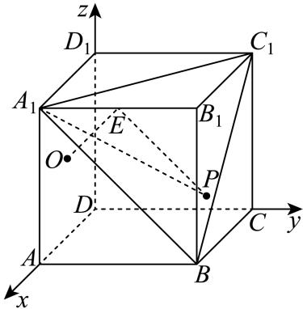

> [!faq]- 2024-2025学年内蒙古包头九十五中高二（上）月考数学试卷（10月份）解析
>
> > [!success]- **【答案】** AC
>
> > [!note]- **【解析】**
> > 对于选项A，如图，以D为原点，建立空间直角坐标系，
> >
> > 
> >
> > 则 $A(1,0,0), A_1(1,0,1), B(1,1,0), C_1(0,1,1), O(\frac{1}{2},0,\frac{1}{2}), E(1,\frac{1}{2},1)$
> >
> > 所以 $\overrightarrow{AB} = (0,1,0),\overrightarrow{A_1B} = (0,1, - 1),\overrightarrow{BC_1} = (-1,0,1),\overrightarrow{OE} = (\frac{1}{2},\frac{1}{2},\frac{1}{2})$ 设平面 $A_{1}BC_{1}$ 的一个法向量为 $\vec{n} = (x,y,z)$ 则 $\left\{ \begin{array}{l}\overrightarrow{n}\perp \overrightarrow{A_1B}\\ \overrightarrow{n}\perp \overrightarrow{BC_1} \end{array} \right.$ ，则 $\left\{ \begin{array}{l}\overrightarrow{n}\cdot \overrightarrow{A_1B} = y - z = 0\\ \overrightarrow{n}\cdot \overrightarrow{BC_1} = -x + z = 0 \end{array} \right.$ 令 $x = 1$ ，则 $y = 1,z = 1$ 则 $\vec{n} = (1,1,1)$ 所以 $\vec{n} = \frac{1}{2}\overrightarrow{OE}$ ，即 $\vec{n} / / \overrightarrow{OE}$ 所以 $OE\bot$ 平面 $A_{1}BC_{1}$ ，故 $A$ 正确；对于选项 $B$ ，设 $AB$ 与平面 $A_{1}BC_{1}$ 所成的角为 $\theta$ 则 $sin\theta = |cos <   \overrightarrow{AB},\overrightarrow{n} >| = \frac{\overrightarrow{AB}\cdot\overrightarrow{n}}{| \overrightarrow{AB} ||\overrightarrow{n} |} = \frac{\sqrt{3}}{3}$ 故 $B$ 错误；对于选项 $C$ ，因为正方体 $ABCD - A_1B_1C_1D_1$ 的棱长为1，所以正△ $A_{1}BC_{1}$ 的边长为 $\sqrt{2}$ 正方体的对角线 $DB_{1} = \sqrt{3}$ 设 $B_{1}$ 到平面 $A_{1}BC_{1}$ 的距离为 $h$ 由 $V_{\text{三棱锥} B_1 - A_1BC_1} = V_{\text{三棱锥} B - A_1B_1C_1}$ 则 $\frac{1}{3}\times \frac{1}{2}\times \sqrt{2}\times \sqrt{2}\times sin60^{\circ}\times h = \frac{1}{3}\times \frac{1}{2}\times 1\times 1\times 1,$ 则 $h = \frac{\sqrt{3}}{3}$ 则 $D$ 到平面 $A_{1}BC_{1}$ 的距离为 $\sqrt{3} -\frac{\sqrt{3}}{3} = \frac{2\sqrt{3}}{3}$ 因为 $\frac{\sqrt{3}}{3} >\frac{\sqrt{3}}{6}$ 所以在以 $B_{1}$ 为顶点的棱上，满足条件的点 $P$ 共有3个又 $AB$ 与平面 $A_{1}BC_{1}$ 所成角的正弦值为 $\frac{\sqrt{3}}{3}$ 所以 $A$ 到平面 $A_{1}BC_{1}$ 的距离为 $\frac{\sqrt{3}}{3}$ 因为 $\frac{\sqrt{3}}{3} >\frac{\sqrt{3}}{6}$ ，所以在棱 $AA_{1}$ 、 $AB$ 上都存在满足条件的点 $P$ 同理在 $CC_{1}$ 、 $CB$ 、 $D_{1}A_{1}$ 、 $D_{1}C_{1}$ 都存在满足条件的点 $P$ 而棱 $DA$ 、 $DC$ 、 $DD_{1}$ 到平面 $A_{1}BC_{1}$ 最近的距离为 $\frac{\sqrt{3}}{3}$ ，所以不存在满足条件的点 $P$ 所以满足条件的点 $P$ 共有9个，故 $C$ 正确；对于选项 $D$ ，设 $P(x^{\prime},1,z^{\prime})(0\leqslant x^{\prime}\leqslant 1,0\leqslant z^{\prime}\leqslant 1)$ ，则 $\overrightarrow{PE} = (1 - x^{\prime}, - \frac{1}{2},1 - z^{\prime})$ ，又 $|PE| = 1$
> >
> > 所以 $\sqrt{(1 - x')^2 + (-\frac{1}{2})^2 + (1 - z')^2} = 1$ ，即 $(x' - 1)^2 + (z' - 1)^2 = \frac{3}{4}$ ，则点 $P$ 在侧面 $BCC_{1}B_{1}$ 内，以 $B_{1}$ 为圆心， $\frac{\sqrt{3}}{2}$ 为半径的一段四分之一的圆弧上运动，故弧长为 $\frac{2\pi\frac{\sqrt{3}}{2}}{4} = \frac{\sqrt{3}\pi}{4}$ ，故 $D$ 错误。故选： $AC$ 。
