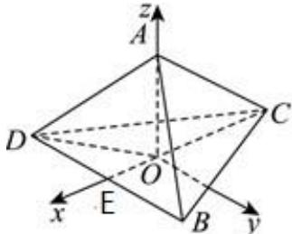

> [!faq]- 2024-2025学年内蒙古包头九十五中高二（上）月考数学试卷（10月份）解析
>
> > [!success]- **【答案】** $[0, \frac{\sqrt{5}}{5} ]$
>
> > [!note]- **【解析】**
> > 由题意知正四面体 $A - BCD$ 的棱长为 $\sqrt{6}$
> >
> > 设A在底面BCD上的射影为O，则O为正三角形BCD的中心，
> >
> > 设 $E$ 为 $BD$ 的中点，连接 $CE, OD, OC$ ，则 $O$ 在 $CE$ 上， $CE \perp BD$
> >
> > $$
> > \mathrm{且} O C = O D = \frac {2}{3} \times \sqrt {6} \times \sin \frac {\pi}{3} = \sqrt {2}, O E = \frac {1}{3} \times \sqrt {6} \times \sin \frac {\pi}{3} = \frac {\sqrt {2}}{2},
> > $$
> >
> > 则 $AO=\sqrt{AD^{2}-DO^{2}}=\sqrt{6-2}=2$ ，而AM= $\sqrt{5}$ ，
> >
> > 故 $OM = \sqrt{AM^2 - AO^2} = \sqrt{5 - 4} = 1$ ，故点 $M$ 轨迹为是平面 $BCD$ 内以 $O$ 为圆心半径为1的圆，
> >
> > 以 $O$ 为坐标原点，以 $OA$ 为 $\pmb{x}$ 轴，过点 $O$ 作 $CD$ 的垂线为 $\pmb{y}$ 轴， $OP$ 为 $\pmb{z}$ 轴，建立平面直角坐标系，
> >
> > 
> >
> > 设 $M(\cos \alpha, \sin \alpha, 0), \alpha \in [0, 2\pi)$ , $B(\frac{\sqrt{2}}{2}, \frac{\sqrt{6}}{2}, 0), A(0, 0, 2), C(-\sqrt{2}, 0, 0)$ ,
> >
> > $$
> > \overrightarrow {A M} = (\cos \alpha , \sin \alpha , 2), \overrightarrow {B C} = \left(\frac {3 \sqrt {2}}{2}, - \frac {\sqrt {6}}{2}, 0\right),
> > $$
> >
> > 故cos $< \overrightarrow{AM}$ ， $\overrightarrow{BC} > = \frac{\overrightarrow{AM} \bullet \overrightarrow{BC}}{|\overrightarrow{AM}| |\overrightarrow{BC}|} = \frac{\frac{3\sqrt{2}}{2} \cos \alpha - \frac{\sqrt{6}}{2} \sin \alpha}{\sqrt{5} \times \sqrt{\frac{9}{2} + \frac{3}{2} + 0}} = \frac{\sqrt{5}}{5} \sin (\frac{\pi}{3} - \alpha)$ ， $\alpha \in [0, 2\pi)$
> >
> > 设直线AM与直线BC的所成角为 $\theta$ ， $\theta\in(0,\frac{\pi}{2}]$ ，
> >
> > 则 $\cos \theta = |\cos < \overrightarrow{AM},\overrightarrow{BC} >| = \frac{\sqrt{5}}{5} |\sin (\frac{\pi}{3} -\alpha)|\in [0,\frac{\sqrt{5}}{5} ].$
> >
> > 故答案为： $[0, \frac{\sqrt{5}}{5} ]$
