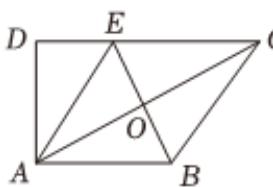
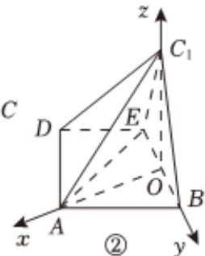

> [!faq]- 2024-2025学年内蒙古包头九十五中高二（上）月考数学试卷（10月份）解析
>
> > [!success]- **【答案】** 详见解析
>
> > [!note]- **【解析】**
> > 详见解析
> >
> > (1) 证明：如图所示，
> >
> > ①  
> > 
> >
> > 
> >
> > 在图①中，连接 $AC$ ，交 $BE$ 于 $O$ ，因为四边形 $ABCE$ 是边长为2的菱形，且 $\angle BCE = 60^{\circ}$ 所以 $AC \perp BE$ ，且 $OA = OC = \sqrt{3}$
> >
> > 在图②中，相交直线OA， $OC_{1}$ 均与BE垂直，
> >
> > 所以 $\angle AOC_{1}$ 是二面角 $A - BE - C_{1}$ 的平面角，
> >
> > 因为 $AC_{1} = \sqrt{6}$
> >
> > 所以 $OA^2 + OC_1^2 = AC_1^2$
> >
> > 所以 $OA \perp OC_{1}$
> >
> > 所以平面 $BC_{1}E \perp$ 平面ABED.
> >
> > (2)由（1）知，分别以直线 $OA$ ， $OB$ ， $OC_{1}$ 为 $\pmb{x}$ ， $\pmb{y}$ ， $z$ 轴建立如图②所示的空间直角坐标系则 $D\left(\frac{\sqrt{3}}{2}, - \frac{3}{2},0\right)$ ， $C_1(0,0,\sqrt{3})$ ， $A(\sqrt{3},0,0)$ ， $B(0,1,0)$ ， $E(0, - 1,0)$ 所以 $\overrightarrow{DC_1} = (-\frac{\sqrt{3}}{2},\frac{3}{2},\sqrt{3}),\overrightarrow{AD} = (-\frac{\sqrt{3}}{2}, - \frac{3}{2},0),\overrightarrow{AB} = (-\sqrt{3},1,0)$
> >
> > $\overrightarrow{AC_1} = (-\sqrt{3}, 0, \sqrt{3}), \overrightarrow{AE} = (-\sqrt{3}, -1, 0)$ ,
> >
> > 设 $\overrightarrow{DP} = \lambda \overrightarrow{DC_1}$ ， $\lambda \in [0,1]$
> >
> > $$
> > \overrightarrow {A P} = \overrightarrow {A D} + \overrightarrow {D P} = \overrightarrow {A D} + \lambda \overrightarrow {D C _ {1}} = (- \frac {\sqrt {3}}{2} - \frac {\sqrt {3}}{2} \lambda , - \frac {3}{2} + \frac {3}{2} \lambda , \sqrt {3} \lambda)
> > $$
> >
> > 设平面 $ABC_{1}$ 的一个法向量 $\overrightarrow{n} = (x, y, z)$ ,
> >
> > 则 $\left\{ \begin{array}{l}\overrightarrow{AB}\bullet \overrightarrow{n} = -\sqrt{3} x + y = 0\\ \overrightarrow{AC_1}\bullet \overrightarrow{n} = -\sqrt{3} x + \sqrt{3} z = 0 \end{array} \right.$
> >
> > 令 $x = 1$ ，则 $y = \sqrt{3}, z = 1$
> >
> > 所以 $\overrightarrow{n} = (1, \sqrt{3}, 1)$ .
> >
> > 因为 $P$ 到平面 $ABC_{1}$ 的距离为 $\frac{\sqrt{15}}{5}$
> >
> > 所以 $d=\frac{|\overrightarrow{AP}\bullet\overrightarrow{n}|}{|\overrightarrow{n}|}=\frac{|-2\sqrt{3}+2\sqrt{3}\lambda|}{\sqrt{5}}=\frac{\sqrt{15}}{5}$
> >
> > 解得 $\lambda = \frac{1}{2}$
> >
> > 由 $\overrightarrow{DP} = \lambda \overrightarrow{DC_1}$ ，得 $(x_P - \frac{\sqrt{3}}{2},y_P + \frac{3}{2},z_P) = \frac{1}{2} (-\frac{\sqrt{3}}{2},\frac{3}{2},\sqrt{3})$
> >
> > 所以 $x_{P} = \frac{\sqrt{3}}{4}, y_{P} = -\frac{3}{4}, z_{P} = \frac{\sqrt{3}}{2}$
> >
> > 所以 $\overrightarrow{AP} = \left(-\frac{3\sqrt{3}}{4}, -\frac{3}{4}, \frac{\sqrt{3}}{2}\right)$
> >
> > 所以 $\overrightarrow{EP} = \overrightarrow{AP} -\overrightarrow{AE} = (\frac{\sqrt{3}}{4},\frac{1}{4},\frac{\sqrt{3}}{2}).$
> >
> > 设直线EP与平面 $ABC_{1}$ 所成的角为 $\theta$ ，
> >
> > 所以 $sin\theta = |\cos \langle \overrightarrow{EP},\overrightarrow{n}\rangle | = \frac{|\overrightarrow{EP}\bullet\overrightarrow{n}|}{|\overrightarrow{EP}||\overrightarrow{n}|} = \frac{\sqrt{15}}{5}.$
