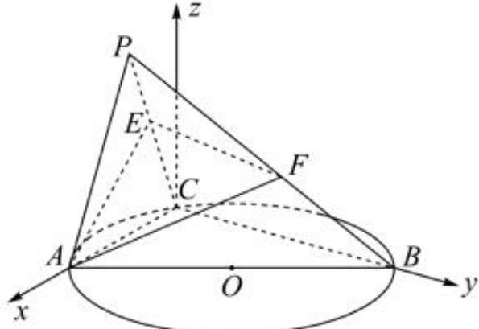

> [!faq]- 2024-2025学年内蒙古包头九十五中高二（上）月考数学试卷（10月份）解析
>
> > [!success]- **【答案】** 详见解析
>
> > [!note]- **【解析】**
> > 详见解析
> >
> > (1)证明：因为C是以AB为直径的圆O上异于A，B的点，所以BC⊥AC，
> >
> > 又平面 $PAC \perp$ 平面ABC，且平面 $PAC \cap$ 平面ABC = AC， $BC \subset$ 平面ABC，
> >
> > 所以 $BC \perp$ 平面PAC，AE ⊂ 平面PAC.
> >
> > 所以 $BC \perp AE.$
> >
> > (2)由 $E$ ， $F$ 分别是 $PC$ ， $PB$ 的中点，连结 $AF$ ， $AE$ ， $EF$ ，所以 $BC \parallel EF$
> >
> > 由（1）知 $BC\perp AE$ ，所以 $EF\perp AE$ ，
> >
> > 所以在 $Rt\triangle AFE$ 中， $\angle AFE$ 就是异面直线 $AF$ 与 $BC$ 所成的角.
> >
> > 因为异面直线 $AF$ 与 $BC$ 所成角的正切值为 $\frac{\sqrt{3}}{2}$
> >
> > 所以 $tan\angle AFE=\frac{\sqrt{3}}{2}$ ，即 $\frac{AE}{EF}=\frac{\sqrt{3}}{2}$ ，
> >
> > 又 $EF \subset$ 平面 $AEF, BC \notin$ 平面 $AEF$ ,
> >
> > 所以 $BC \parallel$ 平面 $AEF$ ，又 $BC \subset$ 平面 $ABC$ ，平面 $EFA \cap$ 平面 $ABC = l$
> >
> > 所以 $BC \parallel l$
> >
> > 所以在平面 $ABC$ 中，过点 $\pmb{A}$ 作 $BC$ 的平行线即为直线 $l$ .
> >
> > 
> >
> > 以 $C$ 为坐标原点， $CA$ ， $CB$ 所在直线分别为 $x$ 轴， $y$ 轴，过 $C$ 且垂直于平面 $ABC$ 的直线为 $z$ 轴，建立空间直角坐标系，设 $AC = 2$ .
> >
> > 因为 $\triangle PAC$ 为正三角形，所以 $AE = \sqrt{3}$ ，从而 $EF = 2$
> >
> > 由已知 $E$ ， $F$ 分别是 $PC$ ， $PB$ 的中点，所以 $BC = 2EF = 4$
> >
> > 则 $A(2,0,0),B(0,4,0),P(1,0,\sqrt{3})$ ，所以 $E(\frac{1}{2},0,\frac{\sqrt{3}}{2}),F(\frac{1}{2},2,\frac{\sqrt{3}}{2})$
> >
> > 所以 $\overrightarrow{AE} = (-\frac{3}{2}, 0, \frac{\sqrt{3}}{2}), \overrightarrow{EF} = (0, 2, 0)$
> >
> > 因为 $BC \parallel l$ ，所以可设 $Q(2, t, 0)$ ，平面 $AEF$ 的一个法向量为 $\overrightarrow{m} = (x, y, z)$
> >
> > 则 $\left\{ \begin{array}{l}\overrightarrow{m}\bullet \overrightarrow{AE} = -\frac{3x}{2} +\frac{\sqrt{3}z}{2} = 0\\ \overrightarrow{m}\bullet \overrightarrow{EF} = 2y = 0 \end{array} \right.$ ，取 $z = \sqrt{3}$ ，得 $\overrightarrow{m} = (1,0,\sqrt{3})$
> >
> > 又 $\overrightarrow{PQ} = (1, t, -\sqrt{3})$ ，则 $|\cos \langle \overrightarrow{PQ}, \overrightarrow{m}\rangle| = |\frac{PQ \bullet \overrightarrow{m}}{|\overrightarrow{PQ}| \bullet |\overrightarrow{m}|}| = \frac{1}{\sqrt{4 + t^2}} \in (0, \frac{1}{2}]$ . 设直线 $PQ$ 与平面 $AEF$ 所成角为 $\theta$ ，则 $sin\theta = \frac{1}{\sqrt{4 + t^2}} \in (0, \frac{1}{2}]$ . 所以直线 $PQ$ 与平面 $AEF$ 所成角的取值范围为 $(0, \frac{\pi}{6}]$ .
