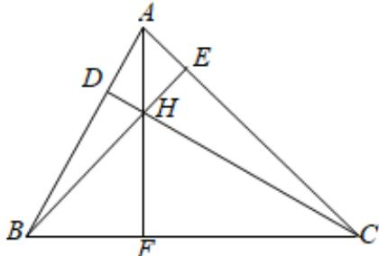

> [!faq]- 2024-2025学年内蒙古包头九十五中高二（上）月考数学试卷（10月份）解析
>
> > [!success]- **【答案】** 详见解析
>
> > [!note]- **【解析】**
> > 详见解析
> >
> > 设 $CD:x+y=0$ ，BE:2x-3y+1=0，如图所示，
> >
> > 
> >
> > (1)联立 $\left\{ \begin{array}{l} x + y = 0 \\ 2x - 3y + 1 = 0 \end{array} \right.$ ，可得 $\left\{ \begin{array}{l} x = -\frac{1}{5} \\ y = \frac{1}{5} \end{array} \right.$ ，故垂心 $H(-\frac{1}{5}, \frac{1}{5})$
> >
> > (2)由（1）知， $k_{AH}=\frac{2-\frac{1}{5}}{1-(-\frac{1}{5})}=\frac{3}{2}$
> >
> > 由“三条高线交于一点”得， $AH \perp BC$ ，
> >
> > $$
> > \therefore k _ {B C} = - \frac {2}{3}
> > $$
> >
> > $\because AC \perp BE, \therefore$ 设 $AC: 3x + 2y + m = 0$ ，代入 $A(1,2)$ ，解得 $m = -7$ ， $\therefore AC: 3x + 2y - 7 = 0$ ，
> >
> > 联立 $\left\{\begin{aligned}3x+2y-7=0\\ x+y=0\end{aligned}\right.$ ，可得 $\left\{\begin{aligned}x=7\\ y=-7\end{aligned}\right.$ ，即 $C(7,-7)$ ，
> >
> > ∴ BC 所在直线的方程为 $y + 7 = -\frac{2}{3}(x - 7)$ ，整理得 $2x + 3y + 7 = 0$ ，设 $N(x_{0},y_{0})$ ,
> > ∴ $\left\{\begin{aligned}\frac{y_{0}-4}{x_{0}+3}\bullet1&=-1\\ \frac{x_{0}-3}{2}-\frac{y_{0}+4}{2}+3&=0\end{aligned}\right.$ ，解得 $x_{0}=1,y_{0}=0$ ，即 $N(1,0)$ ∴ N到直线BC的距离 $d=\frac{|2+7|}{\sqrt{2^{2}+3^{2}}}=\frac{9\sqrt{13}}{13}.$
