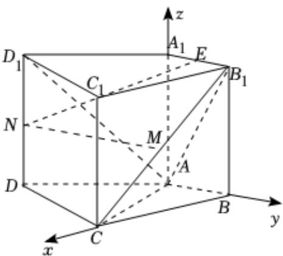

> [!faq]- 2024-2025学年内蒙古包头九十五中高二（上）月考数学试卷（10月份）解析
>
> > [!success]- **【答案】** 详见解析
>
> > [!note]- **【解析】**
> > 详见解析
> >
> > (1)证明：以点A为坐标原点建立空间直角坐标系如图所示，
> > 则 $A(0,0,0)$ ， $B(0,1,0)$ ， $C(2,0,0)$ ， $D(1,-2,0)$ ， $A_{1}(0,0,2)$ ， $B_{1}(0,1,2)$ ， $C_{1}(2,0,2)$ ， $D_{1}(1,-2,2)$ ，
> > 因为M，N分别为 $B_{1}C$ ， $D_{1}D$ 的中点，
> > 则 $M(1,\frac{1}{2},1),N(1,-2,1)$ 由题意可知， $AA_{1}=(0,0,2)$ 是平面ABCD的一个法向量，
> > 又 $\overrightarrow{MN}=(0,-\frac{5}{2},0)$ 所以 $\overrightarrow{AA_{1}}\cdot\overrightarrow{MN}=0$ 又MN≠平面ABCD，
> > 故MN//平面ABCD；
> >
> > 
> >
> > (2)由（1）可知， $\overrightarrow{AD_{1}}=(1,-2,2)$ ， $\overrightarrow{AC}=(2,0,0)$ ， $\overrightarrow{AB_{1}}=(0,1,2)$ ，设平面 $ACD_{1}$ 的法向量为 $\overrightarrow{m}=(x,y,z)$ ，
> > 则 $\left\{\begin{aligned}\overrightarrow{m}\bullet\overrightarrow{AD_{1}}&=x-2y+2z=0\\ \overrightarrow{m}\bullet\overrightarrow{AC}&=2x=0\end{aligned}\right.$ 令z=1，则y=1，x=0，
> > 故 $\overrightarrow{m}=(0,1,1)$ ，
> > 设平面 $ACB_{1}$ 的法向量为 $\overrightarrow{n}=(a,b,c)$ ，
> > 则 $\left\{\begin{aligned}\overrightarrow{n}\bullet\overrightarrow{AB_{1}}&=b+2c=0\\ \overrightarrow{n}\bullet\overrightarrow{AC}&=2a=0\end{aligned}\right.$ 令c=1，则b=-2，a=0，
> > 故 $\overrightarrow{n}=(0,-2,1)$ ，
> > 所以 $|\cos<\overrightarrow{m},\overrightarrow{n}>|=\left|\frac{\overrightarrow{m}\bullet\overrightarrow{n}}{|\overrightarrow{m}||\overrightarrow{n}|}\right|=\frac{1}{\sqrt{2}\times\sqrt{5}}=\frac{\sqrt{10}}{10}$ 故二面角 $D_{1}-AC-B_{1}$ 的余弦值为 $\frac{\sqrt{10}}{10}$ .
