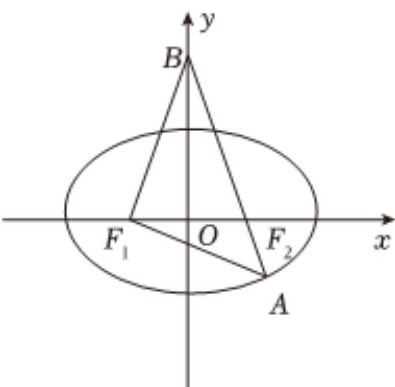

<!-- question-source:start -->
3、已知 $F_{1}$ ， $F_{2}$ 分别是椭圆 $C:\frac{x^{2}}{a^{2}}+\frac{y^{2}}{b^{2}}=1(a>b>0)$ 的左、右焦点，如图，过 $F_{2}$ 的直线与C交于点A，与y轴交于点B， $\overrightarrow{F_{1}A}\cdot\overrightarrow{F_{1}B}=0$ ， $\overrightarrow{BF_{2}}=4\overrightarrow{F_{2}A}$ ，设C的离心率为e，则（）

A $|AF_{2}| = \frac{a}{2}$

B $2\cos \angle BF_{1}F_{2} = e$

C $\sin\angle F_{1}AF_{2}=\frac{3}{5}$

D $e^2 = \frac{2}{5}$
<!-- question-source:end -->

![[Q00091827A1]]
