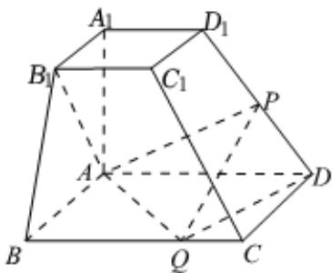

<!-- question-source:start -->
4. 若直线 $y = x + 1$ 与椭圆 $C$ 相交于 $A$ 、 $B$ 两点，且 $\triangle AOB$ 的面积为 $\frac{3}{4} (O$ 为坐标原点），求椭圆 $C$ 的标准方程.

如图，已知四棱台 $ABCD - A_{1}B_{1}C_{1}D_{1}$ 的上、下底面分别是边长为2和4的正方形， $A_{1}A = 4$ ，且 $A_{1}A \perp$ 底面 $ABCD$ ，点 $P$ 、 $Q$ 分别在棱 $DD_{1}$ 、 $BC$ 上.

1 若 $P$ 是 $DD_{1}$ 的中点，证明： $AB_{1} \perp PQ$ ；

2 若 $PQ \parallel$ 平面 $ABB_{1}A_{1}$ ，二面角 $P - QD - A$ 的余弦值为 $\frac{4}{9}$ ，求四面体 $ADPQ$ 的体积.
<!-- question-source:end -->

![[Q00091834A1]]
