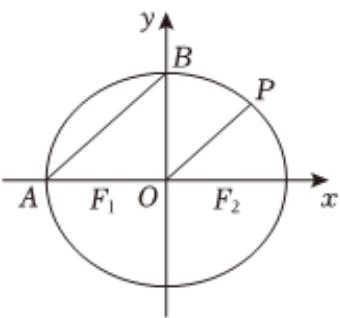
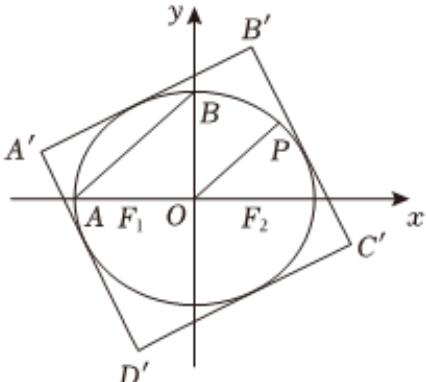

<!-- question-source:start -->
5、如图1，椭圆 $E:\frac{x^{2}}{a^{2}}+\frac{y^{2}}{b^{2}}=1(a>b>0)$ 的左右焦点分别为 $F_{1},F_{2}$ ，点A，B分别为椭圆E与x轴负半轴、y轴正半轴的交点，且椭圆上的点 $P(\sqrt{2},y_{0})$ 满足AB//OP， $|F_{2}A|=3$ .

  
图1

  
图2

1 求椭圆 $\pmb{E}$ 的标准方程；

2 图2中矩形 $A^{\prime}B^{\prime}C^{\prime}D^{\prime}$ 的四条边分别与椭圆E相切，求矩形 $A^{\prime}B^{\prime}C^{\prime}D^{\prime}$ 面积的取值范围.
<!-- question-source:end -->

![[Q00091835A1]]
