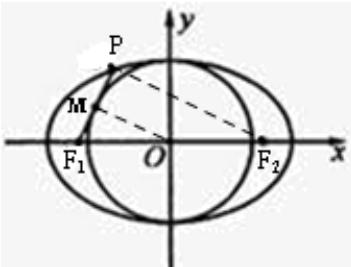

> [!faq]- 2024-2025学年内蒙古包头八十一中高二（上）期中数学试卷解析
>
> > [!success]- **【答案】** A
>
> > [!note]- **【解析】**
> > 设以椭圆的短轴为直径的圆与线段 $PF_{1}$ 相切于点 $M$ ，连结 $OM$ 、 $PF_{2}$
> >
> > ∵ M、O 分别为 $PF_{1}$ 、 $F_{1}F_{2}$ 的中点，
> >
> > $$
> > \therefore M O / / P F _ {2} \text {, 且} \left| P F _ {2} \right| = 2 \left| M O \right| = 2 b
> > $$
> >
> > 又∵线段 $PF_{1}$ 与圆O相切于点M，可得 $OM\perp PF_{1}$ ，∴ $PF_{1}\perp PF_{2}$ ，
> >
> > $Rt\triangle PF_{1}F_{2}$ 中， $\left|F_1F_2\right| = 2c$ ， $\left|PF_2\right| = 2b$
> >
> > $$
> > \therefore | P F _ {1} | = \sqrt {| F _ {1} F _ {2} | ^ {2} - | P F _ {2} | ^ {2}} = \sqrt {4 c ^ {2} - 4 b ^ {2}}
> > $$
> >
> > 根据椭圆的定义，得 $\left|PF_{1}\right|+\left|PF_{2}\right|=2a$ ，
> >
> > 
> >
> > $\therefore \sqrt{4c^2 - 4b^2} + 2b = 2a$ ，即 $\sqrt{c^2 - b^2} = a - b$
> >
> > 两边平方得： $c^2 - b^2 = (a - b)^2$ ，即 $a^2 - 2b^2 = (a - b)^2$ ，化简得 $2ab - 3b^2 = 0$ ，解得 $b = \frac{2}{3} a$ 因此， $c = \sqrt{a^2 - b^2} = \frac{\sqrt{5}}{3} a$ ，可得椭圆的离心率 $e = \frac{c}{a} = \frac{\sqrt{5}}{3}$
> >
> > 故选：A.
