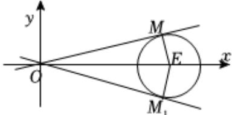

> [!faq]- 2024-2025学年内蒙古包头八十一中高二（上）期中数学试卷解析
>
> > [!success]- **【答案】** C
>
> > [!note]- **【解析】**
> > 设动点 $M(x,y)$ ，由题意 $\frac{\sqrt{x^2 + y^2}}{\sqrt{(x - 3)^2 + y^2}} = 2$
> >
> > 化简得 $(x - 4)^2 + y^2 = 4$
> >
> > 所以点M的轨迹为圆 $E:(x-4)^{2}+y^{2}=4$ ，
> >
> > 如图，过点O作圆E的切线，连接EM，
> >
> > 
> >
> > 则 $|EM|=2,|OE|=4,$
> >
> > 所以 $\angle MOE = \frac{\pi}{6}$ ，同理 $\angle M_{1}OE = \frac{\pi}{6}$
> >
> > 则直线 $OM$ 的斜率范围为 $[- \frac{\sqrt{3}}{3}, \frac{\sqrt{3}}{3}]$ .
> >
> > 故选：C.
