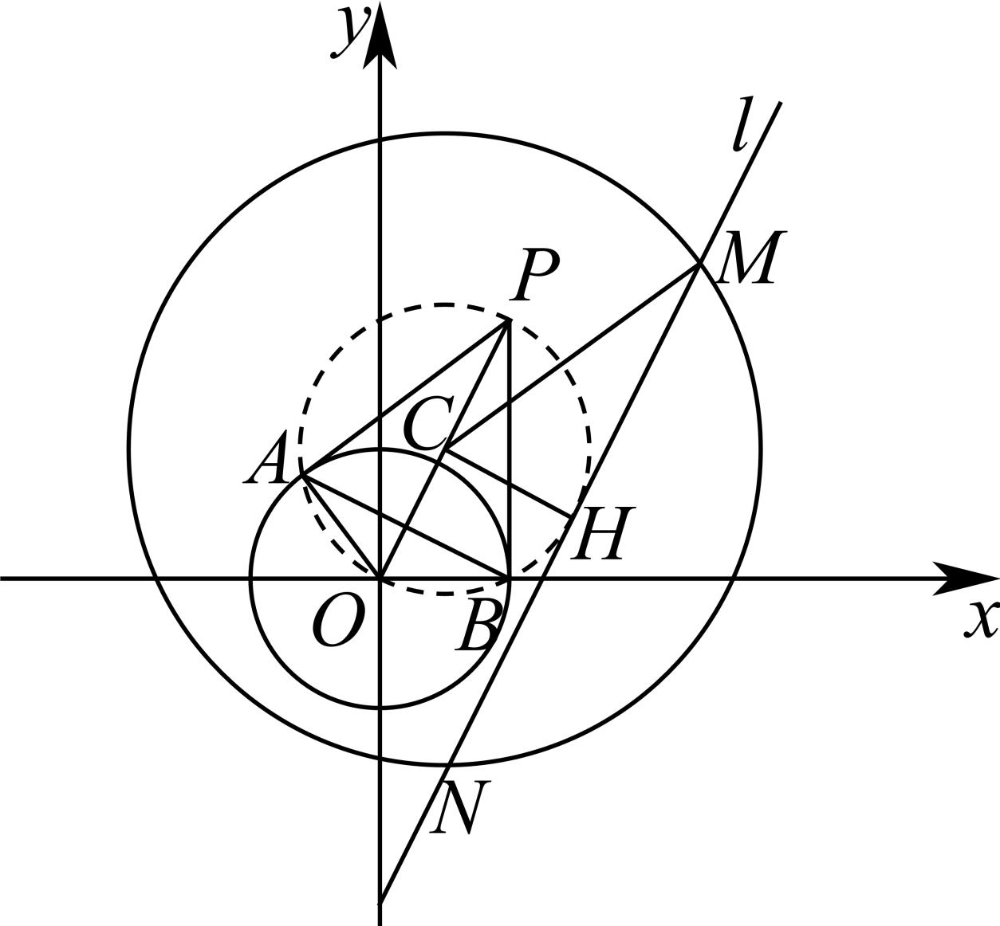

> [!faq]- 2024-2025学年内蒙古包头八十一中高二（上）期中数学试卷解析
>
> > [!success]- **【答案】** BD
>
> > [!note]- **【解析】**
> > 对于选项A，由圆 $O:x^{2}+y^{2}=4$ ，圆 $C:(x-1)^{2}+(y-2)^{2}=25$ ，可得 $O(0,0)$ ， $C(1,2)$ ，
> > ∵ $|OC| = \sqrt{5} < 5 - 2 = 3$ ，则圆C与圆O内含，则A选项错误；
> >
> > 对于选项 $B$ ，直线 $l:(2m + 1)x + (1 - m)y - 5m - 4 = 0$ ，化简可得
> >
> > $$
> > (2 x - y - 5) m + (x + y - 4) = 0
> > $$
> >
> > $\because m \in R$ ，由 $\left\{ \begin{array}{l} 2x - y - 5 = 0 \\ x + y - 4 = 0 \end{array} \right.$ ，解得 $\left\{ \begin{array}{l} x = 3 \\ y = 1 \end{array} \right.$ ，即直线 $l$ 过定点 $H(3,1)$ ， $\therefore B$ 选项正确；
> >
> > 对于选项C，如图，
> >
> > 
> >
> > $\because$ 弦长 $|MN| = 2\sqrt{R^2} - d^2$ ，(其中 $R$ 是圆 $C$ 的半径， $d$ 是点 $C$ 到直线 $l$ 的距离），
> >
> > ∵ R = 5，要使|MN|取最小值，只需d最大.
> >
> > 由垂径定理，结合图形可知，当且仅当 $CH \perp MN$ 时， $d_{max} = |CH| = \sqrt{(1 - 3)^2 + (2 - 1)^2} = \sqrt{5}$
> >
> > 此时圆 $C$ 被直线 $l$ 截得的弦长 $\vert MN\vert$ 的最小值为 $2\sqrt{5^2 - (\sqrt{5})^2} = 4\sqrt{5}$ 但此时，直线 $CH$ 的斜率为 $\pmb{k}_{CH} = \frac{2 - 1}{1 - 3} = -\frac{1}{2}$ ，则 $\pmb{k}_l = 2$ 直线 $l:(2m + 1)x + (1 - m)y - 5m - 4 = 0$ ，可得 $k_{l} = \frac{2m + 1}{m - 1}$ ， $\because \frac{2m + 1}{m - 1} = 2$ 方程无解， $\therefore |MN|$ 取不到最小值 $4\sqrt{5}$ ，∴ $C$ 选项错误；
> >
> > 对于选项D，过点 $P(2,4)$ 作圆O的两条切线，切点分别为A，B，则OA⊥PA，OB⊥PB，
> >
> > 四边形 $PAOB$ 的外接圆的圆心为 $OP$ 的中点 $(1,2)$ ，圆的半径为 $r = \frac{1}{2}\sqrt{2^2 + 4^2} = \sqrt{5}$ ，
> >
> > 则该圆的方程为： $(x - 1)^2 +(y - 2)^2 = 5$
> >
> > 依题可知直线 $AB$ 为圆 $(x - 1)^2 + (y - 2)^2 = 5$ 与 $O: x^2 + y^2 = 4$ 的公共弦，
> >
> > 由 $(x - 1)^2 + (y - 2)^2 = 5$ 与 $x^2 + y^2 = 4$ ，两式相减，可得： $x + 2y - 2 = 0$ ，即公共弦长所在的直线方程 $x + 2y - 2 = 0$ ， $\therefore D$ 选项正确.
> >
> > 故选：BD.
