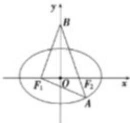

> [!faq]- 2024-2025学年内蒙古包头八十一中高二（上）期中数学试卷解析
>
> > [!success]- **【答案】** ABD
>
> > [!note]- **【解析】**
> > 依题意，设 $\left|AF_{2}\right|=m$ ，则 $\left|BF_{2}\right|=4m=\left|BF_{1}\right|\cdot\left|AF_{1}\right|=2a-m$ ，如图，在 $Rt\triangle ABF_{1}$ 中， $16m^{2}+(2a-m)^{2}=25m^{2}$ ，
> >
> > 
> >
> > 则 $(a - 2m)(a + m) = 0$ ，故 $a = 2m$ 或 $a = -m$ （舍去），所以 $\left|AF_2\right| = \frac{a}{2}$ ，故选项 $A$ 正确；
> >
> > 由 $\left|AF_{1}\right|=\frac{3a}{2}$ ， $\left|BF_{2}\right|=\left|BF_{1}\right|=2a$ ，则 $\left|AB\right|=\frac{5a}{2}$ ，
> >
> > 在 $Rt\triangle OBF_{1}$ 中， $\cos \angle BF_1F_2 = \frac{|OF_1|}{|BF_1|} = \frac{c}{2a} = \frac{e}{2}$ ，即 $2\cos \angle BF_{1}F_{2} = e$ ，故选项 $B$ 正确；
> >
> > 在 $Rt\triangle ABF_{1}$ 中， $\sin \angle F_1AF_2 = \sin \angle F_1AB = \frac{|BF_1|}{|AB|} = \frac{2a}{\frac{5a}{2}} = \frac{4}{5}$ ，选项 $C$ 错误；
> >
> > 在 $\triangle AF_{1}F_{2}$ 中， $\cos \angle F_{1}AF_{2} = \frac{\frac{9a^2}{4} + \frac{a^2}{4} - 4c^2}{2 \times \frac{3a}{2} \times \frac{a}{2}} = \frac{3}{5}$ ，整理得 $c^2 = \frac{2}{5} a^2$ ，故 $e^2 = \frac{c^2}{a^2} = \frac{2}{5}$ ，选项 $D$ 正确.
> >
> > ## 故选：ABD.
