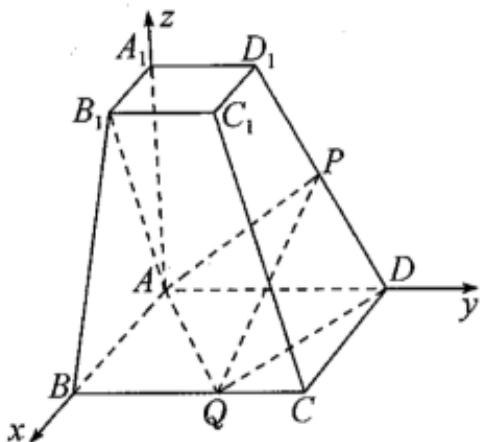

> [!faq]- 2024-2025学年内蒙古包头八十一中高二（上）期中数学试卷解析
>
> > [!success]- **【答案】** 详见解析
>
> > [!note]- **【解析】**
> > 详见解析
> >
> > 
> >
> > (1)证明：由题意， $A_{1}A$ ， $AB$ ， $AD$ 两两垂直，  
> > 故以点 $A$ 为坐标原点，建立空间直角坐标系如图所示，  
> > 则 $A(0,0,0)$ ， $B_{1}(2,0,4),D(0,4,0)$ $D_{1}(0,2,4),Q(4,m,0)$ ，其中 $m = BQ$ ， $0\leqslant m\leqslant 4$ 因为 $P$ 是 $DD_{1}$ 的中点，  
> > 则 $P(0,3,2)$ 所以 $\overrightarrow{PQ} = (4,m - 3, - 2)$ 又 $\overrightarrow{AB_1} = (2,0,4)$ 所以 $\overrightarrow{AB_1}\bullet \overrightarrow{PQ} = 2\times 4 + 0\times (m - 3) + 4\times (-2) = 0$ 故 $\overrightarrow{AB_1}\perp \overrightarrow{PQ}$ 所以 $AB_{1}\bot PQ$ (2)由题意可知， $\overrightarrow{DQ} = (4,m - 4,0)$ ， $\overrightarrow{DD_1} = (0, - 2,4)$ 设平面 $PQD$ 的法向量为 $\vec{n} = (x,y,z)$ 则 $\left\{ \begin{array}{l}\overrightarrow{n}\bullet \overrightarrow{DQ} = 0\\ \overrightarrow{n}\bullet \overrightarrow{DD_1} = 0 \end{array} \right.$ 即 $\left\{ \begin{array}{l}4x + (m - 4)y = 0\\ -2y + 4z = 0 \end{array} \right.$ 令 $y = 4$ ，则 $x = 4 - m,z = 2$ 故 $\vec{n} = (4 - m,4,2)$ 又平面 $AQD$ 的一个法向量为 $\vec{m} = (0,0,1)$ 所以 $|\cos <  \vec{m},\vec{n} >| = \frac{|\vec{m}\bullet\vec{n}|}{|\vec{m}||\vec{n}|} = \frac{2}{\sqrt{(4 - m)^2 + 16 + 4}}$ 又二面角 $P - QD - A$ 的余弦值为 $\frac{4}{9}$ 所以 $\frac{2}{\sqrt{(4 - m)^2 + 16 + 4}} = \frac{4}{9}$
> >
> > 解得 $m = \frac{7}{2}$ 或 $m = \frac{9}{2}$ （舍），  
> > 此时 $Q(4, \frac{7}{2}, 0)$ ，  
> > 设 $\overrightarrow{DP} = \lambda \overrightarrow{DD_1}(0 < \lambda \leq 1)$ ，  
> > 因为 $\overrightarrow{DD_1} = (0, -2, 4)$ ，  
> > 所以 $P(0, 4 - 2\lambda, 4\lambda)$ ，  
> > 故 $\overrightarrow{PQ} = (4, 2\lambda - \frac{1}{2}, -4\lambda)$ ，  
> > 因为 $PQ //$ 平面 $ABB_1A_1$ ，且平面 $ABB_1A_1$ 的一个法向量为 $\vec{t} = (0, 1, 0)$ ，所以 $\overrightarrow{PQ} \bullet \vec{t} = 0$ ，即 $2\lambda - \frac{1}{2} = 0$ ，  
> > 解得 $\lambda = \frac{1}{4}$ ，  
> > 则 $P(0, \frac{7}{2}, 1)$ ，  
> > 于是将四面体ADPQ视为以△ADQ为底面的三棱锥 $P - ADQ$ ，则其高为 $h = 1$ ，故四面体ADPQ的体积为 $V = \frac{1}{3} \bullet S_{\triangle ADQ} \bullet h = \frac{1}{3} \times \frac{1}{2} \times 4 \times 4 \times 1 = \frac{8}{3}$ .
