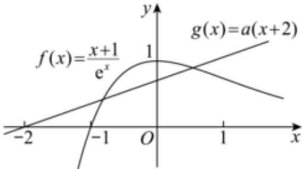

> [!faq]- 2024-2025学年内蒙古包头八十一中高二（下）月考数学试卷（6月份）解析
>
> > [!success]- **【答案】** D
>
> > [!note]- **【解析】**
> > 由不等式 $ae^{x}(x+2)<x+1$ ，可得 $a(x+2)<\frac{x+1}{e^{x}}$ ，
> >
> > 设 $g(x)=a(x+2)$ ， $f(x)=\frac{x+1}{e^{x}}$ ，
> >
> > 则 $f'(x)=\frac{-x}{e^{x}}$ ，
> >
> > 当 $x < 0$ 时， $f'(x) > 0$ ， $f(x)$ 在 $(- \infty, 0)$ 上单调递增，
> >
> > 当 $x > 0$ 时， $f^{\prime}(x) < 0$ ， $f(x)$ 在 $(0, +\infty)$ 上单调递减，
> >
> > 当x=0时， $f(x)$ 取极大值1.
> >
> > 又 $f(-1)=0$ ，且x>0时， $f(x)>0$ ，
> >
> > 直线 $g(x)=a(x+2)$ 恒过点 $(-2,0)$ ,
> >
> > 当 $a > 0$ 时，作出 $g(x) = a(x + 2)$ 与 $f(x) = \frac{x + 1}{e^x}$ 的图像如下所示，
> >
> > 
> >
> > $g(x) < f(x)$ 恰有1个整数解，只需要满足 $\left\{ \begin{array}{l} f(0) > g(0) \\ f(1) \leq g(1) \end{array} \right.$ ，
> >
> > 解得 $\frac{2}{3e} \leq a < \frac{1}{2}$
> >
> > 当 $a \leqslant 0$ 时，显然 $g(x) < f(x)$ 有无穷多个整数解，不满足条件，
> >
> > 所以a的取值范围为 $\left[\frac{2}{3e},\frac{1}{2}\right)$ .
> >
> > 故选：D.
