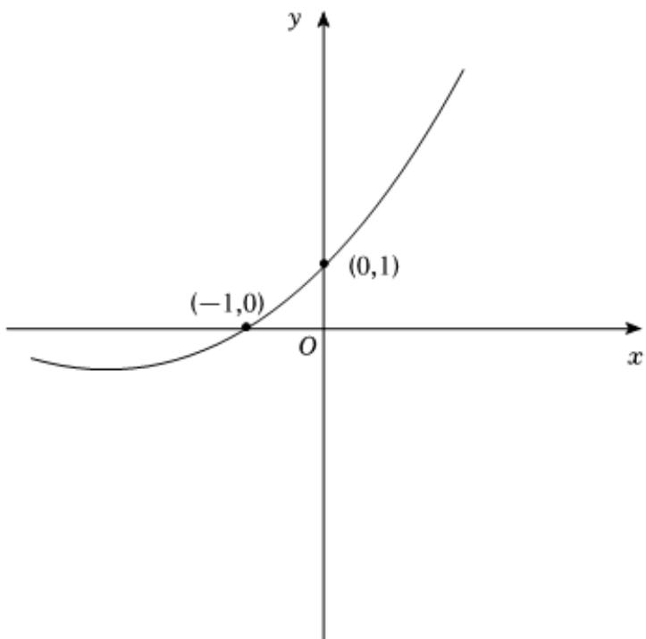

> [!faq]- 2024-2025学年内蒙古包头八十一中高二（下）第一次月考数学试卷解析
>
> > [!success]- **【答案】** C
>
> > [!note]- **【解析】**
> > 由题知方程 $f(x) = 0$ 有两个实数根，即 $(x + 1)e^{x} = 2m - 1$ ，
> >
> > 所以 $y=(x+1)e^{x}$ ， $(x\neq-1)$ ，y=2m-1图像有两个交点，
> >
> > 设 $g(x) = (x + 1)e^{x}$ ，则 $g'(x) = (x + 2)e^{x}$ ，令 $g'(x) = 0$ ，解得 $x = -2$ ，
> >
> > 当 $x\in (-\infty , - 2)$ ， $g^{\prime}(x) <   0$ ， $g(x)$ 单调递减，当 $x\in (-2, + \infty)$ ， $g(x) > 0$ ， $g(x)$ 单调递增，
> >
> > 所以当 $x = -2$ ， $g(x)$ 有极小值 $g(-2) = -\frac{1}{e^2}$
> >
> > 所以可以作出 $g(x)$ 函数图象，
> >
> > 当 $x \to -\infty 0$ 时， $g(x) \to 0$ 且 $g(x) < 0$ ，当 $x \to +\infty$ 时， $g(x) \to +\infty$
> >
> > 
> >
> > 故 $-\frac{1}{e^2} < 2m - 1 < 0$ ，解得 $\frac{e^2 - 1}{2e^2} < m < \frac{1}{2}$
> >
> > 故选：C.
