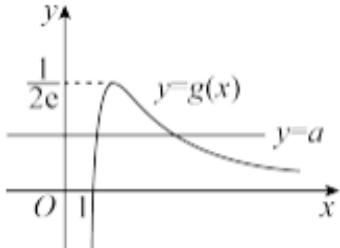

> [!faq]- 2024-2025学年内蒙古包头八十一中高二（下）第一次月考数学试卷解析
>
> > [!success]- **【答案】** BCD
>
> > [!note]- **【解析】**
> > 选项 $A$ ，由 $\pmb{x} > 0$ ，令 $f(x) = lnx - ax^2 = 0\Rightarrow a = \frac{lnx}{x^2}$ ，设 $g(x) = \frac{lnx}{x^2}$
> >
> > $$
> > g ^ {\prime} (x) = \frac {\frac {1}{x} \cdot x ^ {2} - 2 x \cdot l n x}{(x ^ {2}) ^ {2}} = \frac {1 - 2 l n x}{x ^ {3}}
> > $$
> >
> > 令 $g^{\prime}(x) = \frac{1 - 2\ln x}{x^{3}} = 0\Rightarrow x = \sqrt{e}$ ，当 $0 <   x <   \sqrt{e}$ 时， $g^{\prime}(x) > 0$ ，当 $x > \sqrt{e}$ 时， $g^{\prime}(x) <   0$
> >
> > 所以 $g(x)$ 在 $(0, \sqrt{e})$ 上单调递减，在 $(\sqrt{e} + \infty)$ 上单调递增，
> >
> > 所以 $g(x)_{max}=g(\sqrt{e})=\frac{1}{2e}$ ，
> >
> > 当 $x = 1$ 时， $g(1) = \frac{ln1}{1^2} = 0$ ，所以当 $x < 1$ ， $g(x) < 0$ ，当 $x \to +\infty$ ， $g(x) \to 0$ ，
> >
> > 所以 $g(x)$ 的图形如图所示：
> >
> > 
> >
> > 由图可知，函数 $f(x)$ 恰有两个零点时，即 $y = a$ 与 $y = \frac{lnx}{x^2}$ 有两个不同的交点，
> >
> > 此时 $0 < a < \frac{1}{2e}$ ，故 $\pmb{A}$ 不正确；
> >
> > 选项 $B$ ，由选项 $A$ ， $g(x) = \frac{lnx}{x^2}\leqslant \frac{1}{2e}$ ，当 $a > \frac{1}{2e}$ 时， $a > \frac{lnx}{x^2}\Leftrightarrow ax^2 >lnx\Leftrightarrow lnx - ax^2 < 0$
> >
> > 即 $f(x) < 0$ 对任意 $x > 0$ 恒成立，故B正确，
> >
> > 选项 $C$ ，由函数 $f(x)$ 有两个零点 $x_{1}$ ， $x_{2}$ ，即 $x_{1}$ ， $x_{2}$ 为方程 $\ln x - ax^2 = 0$ 的两根，
> >
> > 即 $\ln x = ax^2 \Leftrightarrow 2\ln x = 2ax^2 \Rightarrow \ln x^2 = 2ax^2$
> >
> > 所以 $\left\{ \begin{array}{l} ln x_{1}^{2} = 2ax_{1}^{2} \\ ln x_{2}^{2} = 2ax_{2}^{2} \end{array} \right.$ ，令 $t_{1} = x_{1}^{2}$ ， $t_{2} = x_{2}^{2}$ ，且 $t_{1} > t_{2}$
> >
> > 则 $\left\{ \begin{array}{l} lnt_1 = 2at_1 \\ lnt_2 = 2at_2 \end{array} \right.$ ，所以 $2a = \frac{lnt_1 - lnt_2}{t_1 - t_2}$
> >
> > 欲证 $x_{1}x_{2}>e$ ，即证 $t_{1}t_{2}>e^{2}$ ，即证明 $\ln t_{1}+\ln t_{2}>2$ ，
> >
> > 只需证明 $lnt_{1} + lnt_{2} = 2a(t_{1} + t_{2}) = (t_{1} + t_{2})\cdot \frac{lnt_{1} - lnt_{2}}{(t_{1} - t_{2})} >2$
> >
> > 只需证明 $lnt_{1}-lnt_{2}>\frac{2(t_{1}-t_{2})}{t_{1}+t_{2}}$ ，即 $ln\frac{t_{1}}{t_{2}}>\frac{2(\frac{t_{1}}{t_{2}}-1)}{\frac{t_{1}}{t_{2}}+1}$
> >
> > 设 $m = \frac{t_1}{t_2} > 1$ ，则 $lnm > \frac{2(m - 1)}{m + 1}$ ， $m > 1$
> >
> > 令 $F(x)=lnm-\frac{2(m-1)}{m+1}(m>1)$ ,
> >
> > 所以
> >
> > $$
> > \begin{array}{l} F ^ {\prime} (x) = \frac {1}{m} - \frac {2 (m + 1) - 2 (m - 1)}{(m + 1) ^ {2}} = \frac {1}{m} - \frac {4}{(m + 1) ^ {2}} = \frac {(m + 1) ^ {2}}{m (m + 1) ^ {2}} - \frac {4 m}{m (m + 1) ^ {2}} \\ = \frac {(m - 1) ^ {2}}{m (m + 1) ^ {2}} > 0 \end{array}
> > $$
> >
> > 所以 $F(x)$ 在 $(1,+\infty)$ 上为增函数，又 $F(1)=0$ ，
> >
> > 所以 $F(m) > F(1) = 0$ ，综上所述，原不等式成立，故 $x_{1}x_{2} > e$ ，故 $C$ 正确，
> >
> > 选项D，当a=0时， $f(x)=\ln x$ ，则不等式 $e^{x}-f(mx)\geqslant(m-1)x$ 对 $x\in(0,+\infty)$ 恒成立，
> > 即 $e^{x}-\ln mx\geqslant(m-1)x=mx-x$ ，即 $e^{x}+x\geqslant\ln mx+mx$ ，即 $e^{x}+\ln e^{r}\geqslant\ln mx+mx$
> >
> > 令 $\varphi (x) = x + \ln x$ ，当 $x > 0$ 时， $\varphi (x)$ 单调递增，
> >
> > 所以 $e^x + \ln e^x \geqslant \ln mx + mx \Leftrightarrow \varphi(e^x) \geqslant \varphi(mx)$ ，所以 $mx \leqslant e^x \Rightarrow m \leqslant \frac{e^x}{x}$ 对任意 $x > 0$ 恒成立，
> >
> > 即求 $h(x)=\frac{e^{x}}{x}$ 在 $(0,+\infty)$ 上的最小值，
> >
> > 由 $h^\prime (x) = \frac{xe^x - e^x}{x^2} = \frac{e^x(x - 1)}{x^2}$ ，当 $0 <   x <   1$ 时， $h^\prime (x) <   0$ ，当 $x > 1$ 时， $h^\prime (x) > 0$
> >
> > 所以 $h(x)$ 在 $(0,1)$ 上单调递减，在 $(1, +\infty)$ 上单调递增，所以 $h(x)_{\min} = h(1) = e$
> >
> > 由 $e^{x}+x\geqslant\ln mx+mx$ ，得mx>0，而x>0，所以m>0，
> >
> > 所以m的取值范围是： $(0,e]$ .
> >
> > 故选：BCD.
