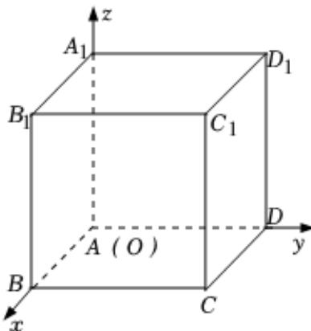

<!-- question-source:start -->
2、在如图所示的空间直角坐标系中， $ABCD - A_{1}B_{1}C_{1}D_{1}$ 是棱长为1的正方体，给出下列结论中，正确的是（）

A 直线 $BD_{1}$ 的一个方向向量为 $(-2, 2, 2)$

B 直线 $BD_{1}$ 的一个方向向量为(2,2,2)

C 平面 $B_{1}CD_{1}$ 的一个法向量为(1,1,1)

D 平面 $B_{1}CD$ 的一个法向量为(1,1,1)
<!-- question-source:end -->

![[Q00090778A1]]
