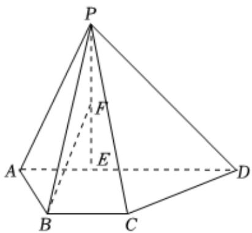

<!-- question-source:start -->
4、如图，在四棱锥 $P - ABCD, BC \parallel AD, AB = BC = 1, AD = 3$ ，点 $E$ 在 $AD$ 上，且 $PE \perp AD, DE = PE = 2$ .

(1)若F为线段PE的中点，求证：BF//平面PCD.

(2)若 $AB\perp$ 平面PAD，求平面PAB与平面PCD夹角的余弦值.

<!-- question-source:end -->

![[Q00092298A1]]
