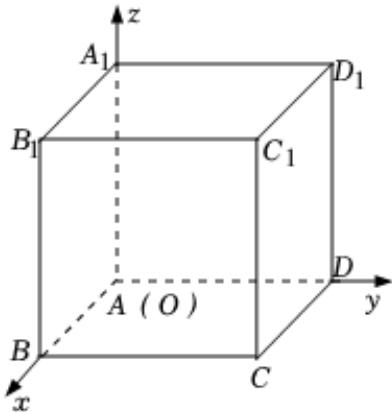

> [!faq]- 2024-2025学年内蒙古包头六中高二（上）期中数学试卷解析
>
> > [!success]- **【答案】** AC
>
> > [!note]- **【解析】**
> > 在如图所示的空间直角坐标系中， $ABCD - A_{1}B_{1}C_{1}D_{1}$ 是棱长为1的正方体，
> >
> > 
> >
> > $B(1,0,0),D_1(0,1,1),\overrightarrow{BD_1} = (-1,1,1)$
> >
> > ∴直线 $BD_{1}$ 的一个方向向量为 $(-2,2,2)$ ，故A正确，B错误；
> >
> > $$
> > C (1, 1, 0), B _ {1} (1, 0, 1), \overline {{C B _ {1}}} ^ {\prime} = (0, - 1, 1), \overline {{C D _ {1}}} ^ {\prime} = (- 1, 0, 1)
> > $$
> >
> > 设平面 $B_{1}CD_{1}$ 的法向量 $\overrightarrow{n}=(x,y,z)$
> >
> > 则 $\left\{ \begin{array}{ll}\overrightarrow{n}\bullet \overrightarrow{CB_1} = -y + z = 0\\ \overrightarrow{n}\bullet \overrightarrow{CD_1} = -x + z = 0 \end{array} \right.$ ，取 $x = 1$ ，得 $\overrightarrow{n} = (1,1,1)$ ，故 $C$ 正确；
> >
> > $$
> > D (0, 1, 0), \overrightarrow {C D} = (- 1, 0, 0)
> > $$
> >
> > 设平面 $B_{1}CD$ 的法向量 $\overrightarrow{m}=(a,b,c)$
> >
> > 则 $\left\{ \begin{array}{ll}\overrightarrow{m}\bullet \overrightarrow{CB_1} = -b + c = 0\\ \overrightarrow{m}\bullet \overrightarrow{CD} = -a = 0 \end{array} \right.$ ，取 $b = 1$ ，得 $\overrightarrow{m} = (0,1,1)$ ，故 $D$ 错误
> >
> > 故选：AC.
