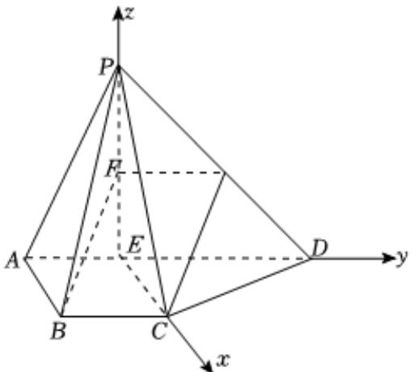

> [!faq]- 2024-2025学年内蒙古包头六中高二（上）期中数学试卷解析
>
> > [!success]- **【答案】** 详见解析
>
> > [!note]- **【解析】**
> > 详见解析
> >
> > (1)证明：如图，设M为PD的中点，连接FM，CM，
> > 因为F是PE中点，所以 $FM\parallel ED$ ，且 $FM=\frac{1}{2}ED$ 因为 $AD\parallel BC$ ，AB=BC=1，AD=3，DE=PE=2，
> > 所以四边形ABCE为平行四边形， $BC\parallel ED$ ，且 $BC=\frac{1}{2}ED$ 所以 $FM\parallel BC$ ，且FM=BC，
> > 即四边形BCMF为平行四边形，
> > 所以 $BF\parallel CM$ 因为 $BF\not\subset$ 平面PCD，CM⊂平面PCD，
> >
> > 所以BF//平面PCD.
> >
> > (2)因为 $AB \perp$ 平面PAD，
> >
> > 所以 $CE \perp$ 平面PAD，EP，ED，EC相互垂直，
> >
> > 以 $\pmb{E}$ 为坐标原点，建立如图所示的空间直角坐标系，
> >
> > 
> >
> > 则 $P(0,0,2), A(0,-1,0), B(1,-1,0), C(1,0,0), D(0,2,0)$
> >
> > 所以 $\overrightarrow{AB} = (1,0,0)$ ， $\overrightarrow{AP} = (0,1,2)$ ， $\overrightarrow{PC} = (1,0,-2)$ ， $\overrightarrow{CD} = (-1,2,0)$
> >
> > 设平面 $PAB$ 的一个法向量为 $\vec{m} = (x_1, y_1, z_1)$
> >
> > 则 $\left\{ \begin{array}{ll}\overrightarrow{m}\bullet \overrightarrow{AB} = x_1 = 0\\ \overrightarrow{m}\bullet \overrightarrow{AP} = y_1 + 2z_1 = 0 \end{array} \right.$ ，取 $z_{1} = -1$ ，则 $\overrightarrow{m} = (0,2, - 1)$
> >
> > 设平面PCD的一个法向量为 $\overrightarrow{n} = (x_2, y_2, z_2)$
> >
> > 则 $\left\{ \begin{array}{l} \overrightarrow{n} \bullet \overrightarrow{PC} = x_2 - 2z_2 = 0 \\ \overrightarrow{n} \bullet \overrightarrow{CD} = -x_2 + 2y_2 = 0 \end{array} \right.$ ，取 $z_2 = 1$ ，则 $\overrightarrow{n} = (2,1,1)$ ，
> >
> > 设平面PAB与平面PCD夹角为 $\theta$ ，
> >
> > $$
> > \cos \theta = \frac {\overrightarrow {m} \bullet \overrightarrow {n}}{| \overrightarrow {m} | \bullet | \overrightarrow {n} |} = \frac {2 - 1}{\sqrt {5} \times \sqrt {6}} = \frac {1}{\sqrt {3 0}} = \frac {\sqrt {3 0}}{3 0}.
> > $$
