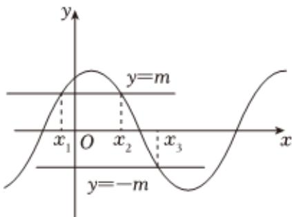

<!-- question-source:start -->
7、设 $m, n$ 为正实数，若 $\frac{1}{m} + \frac{1}{n} \leqslant 4, (m - n)^2 = 16(mn)^3$ ，则 $m + n$ 的取值范围为（）
A $\{2\}$ B $[1, 2]$ C $[2, +\infty)$ D $(0, 1) \cup (2, +\infty)$

<!-- question-source:end -->

![[Q00090813A1]]
