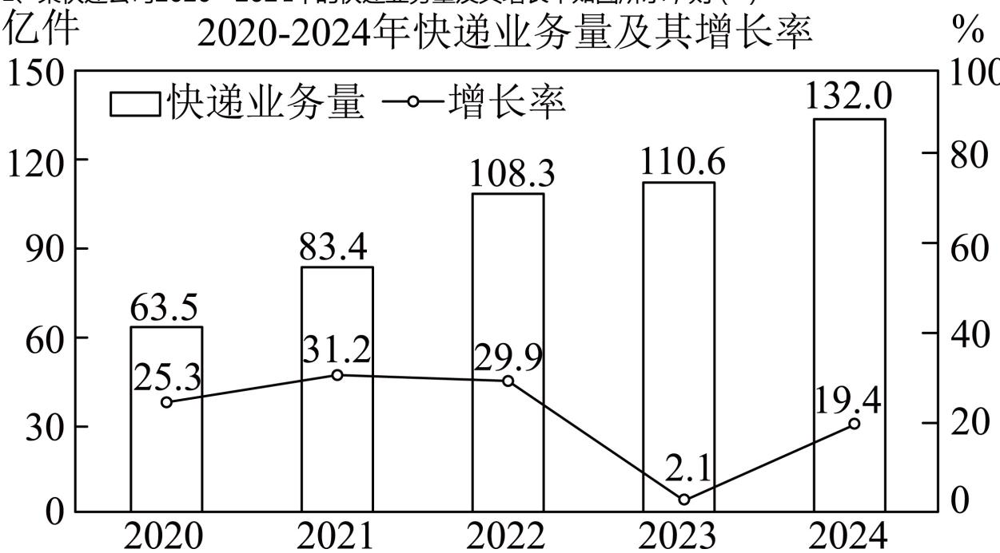

<!-- question-source:start -->
1、某快递公司2020—2024年的快递业务量及其增长率如图所示，则（）

A 该公司2020－2024年快递业务量逐年上升  
B 该公司2020－2024年快递业务量的极差为68.5亿件  
C 该公司2020－2024年快递业务量的增长率的中位数为 $29.9\%$ D 该公司2020－2024年快递业务量的增长率的平均数为 $21.58\%$
<!-- question-source:end -->

![[Q00090815A1]]
