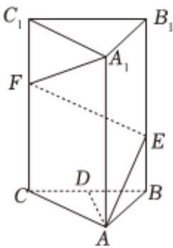

<!-- question-source:start -->
2、如图，在正三棱柱 $ABC-A_{1}B_{1}C_{1}$ 中， $AA_{1}=2AB$ ，D为棱BC的中点，点E，F分别在棱 $BB_{1}$ ， $CC_{1}$ 上，当 $AE+EF+FA_{1}$ 取得最小值时，下列说法正确的是（）

A $AE = EF$

B 直线 $EF$ 与平面 $ABC$ 所成角的正切值为 $\frac{1}{3}$

C 直线AD与EF所成的角为 $60^{\circ}$

$$
V _ {D - A A _ {1} F} = V _ {A _ {1} - A D E}
$$
<!-- question-source:end -->

![[Q00090816A1]]
