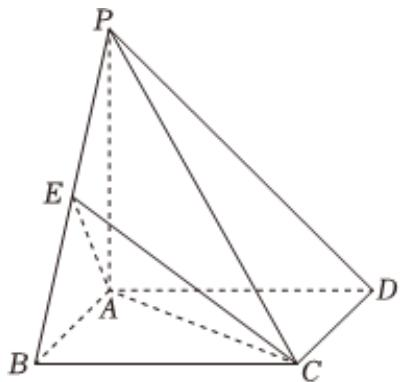

<!-- question-source:start -->
3. 如图，在四棱锥 $P - ABCD$ 中， $PA \perp$ 底面 $ABCD$ ， $ABCD$ 为矩形， $AB = AD = \frac{\sqrt{2}}{2} PD$ ，点 $E$ 在棱 $PB$ 上，且直线 $PD$ 与 $CE$ 所成的角为 $\frac{\pi}{6}$ .

1 证明：点 $E$ 为棱 $P B$ 的中点；

2 求直线 $CD$ 与平面 $ACE$ 所成角的正弦值.
<!-- question-source:end -->

![[Q00092319A1]]
