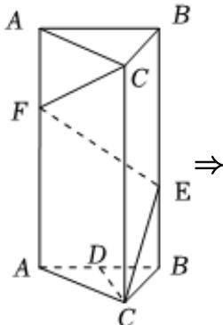
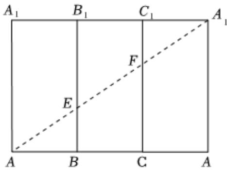
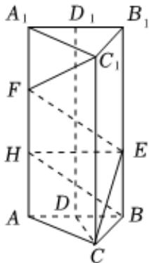

> [!faq]- 2024-2025学年内蒙古包头六中高二（下）月考数学试卷（6月份）解析
>
> > [!success]- **【答案】** AD
>
> > [!note]- **【解析】**
> > 在正三棱柱 $ABC-A_{1}B_{1}C_{1}$ 中，其侧面展开图，如图.
> >
> > 
> >
> > 
> >
> > 当 $AE + EF + FA_{1}$ 取得最小值时，在侧面展开图中连接 $AA_{1}$ ，分别交 $BB_{1}$ ， $CC_{1}$ 于点E，F，由相似，知点E，F分别为 $BB_{1}$ ， $CC_{1}$ 的三等分点，对于A，如图，过点E作 $EH \perp CC_{1}$ 于点H，
> >
> > 
> >
> > 由勾股定理，得 $AE = \sqrt{AB^2 + BE^2}$ ， $EF = \sqrt{EH^2 + HF^2}$
> >
> > 因为 $AB = BC = EH$ ， $BE = HF$ ，所以 $AE = EF$ ，故 $A$ 正确；
> >
> > 对于B，因为EB=FH= $\frac{1}{3}BB_{1}$ ，且EB//FH，
> >
> > 所以四边形FHBE为平行四边形，
> >
> > 所以EF//BH，
> >
> > 所以直线 $EF$ 与平面 $ABC$ 所成的角即为直线 $BH$ 与平面 $ABC$ 所成的角，
> >
> > 因为 $CC_{1}\perp$ 平面ABC
> >
> > 所以 $\angle HBC$ 为直线 $BH$ 与平面 $ABC$ 所成的角，
> >
> > 又 $AA_{1}=2AB$ ，且H为三等分点，
> >
> > 所以 $tan\angle HBC=\frac{HC}{BC}=\frac{\frac{1}{3}CC_{1}}{BC}=\frac{\frac{2}{3}BC}{BC}=\frac{2}{3}$ ，故B错误；
> >
> > 对于C，在正三棱柱ABC-A\_{1}B\_{1}C\_{1}中，CC\_{1}⊥平面ABC，
> >
> > 又 $AD \subset$ 平面 $ABC$ ，所以 $CC_{1} \perp AD$
> >
> > 又AB = AC = BC，且D为BC的中点，
> >
> > 所以 $AD \perp BC$ ，因为 $BC \cap CC_1 = C$ ， $BC \subset$ 平面 $BCC_1B_1$ ， $CC_1 \subset$ 平面 $BCC_1B_1$ 所以 $AD \perp$ 平面 $BCC_1B_1$ ，又 $EF \subset$ 平面 $BCC_1B_1$ ，所以 $AD \perp EF$ ，
> >
> > 所以直线AD与EF所成的角为 $90^{\circ}$ ，故C错误；
> >
> > 对于 $D$ ， $V_{D - AA_1F} = V_{F - AA_1D}$ ， $V_{A_1 - ADE} = V_{E - AA_1D}$
> >
> > 取 $B_{1}C_{1}$ 的中点，连接 $DD_{1}$ ，所以 $DD_{1}\perp BC$ ， $CC_{1}//DD_{1}$ ， $BB_{1}//DD_{1}$ ，
> >
> > 因为 $CC_{1}\neq$ 平面 $AA_{1}D$ ， $DD_{1}\subset$ 平面 $AA_{1}D$ ，
> >
> > 所以 $CC_{1}$ //平面 $AA_{1}D$ ，同理 $BB_{1}$ //平面 $AA_{1}D$
> >
> > 由 $C$ 的分析，知 $BC \perp AD$ ， $AD \cap DD_1 = D$ ， $AD \subset$ 平面 $AA_1D$ ， $DD_1 \subset$ 平面 $AA_1D$
> >
> > 所以 $BC \perp$ 平面 $AA_{1}D$
> >
> > 所以点 $F$ 到平面 $AA_{1}D$ 的距离为 $CD$ ，点 $E$ 到平面 $AA_{1}D$ 的距离为 $BD$
> >
> > 因为 $CD = BD$ ，所以 $V_{F-AA_1D} = V_{E-AA_1D}$ ，
> >
> > 即 $V_{D-AA_{1}F}=V_{A_{1}-ADE}$ ，故D正确.
> >
> > 故选：AD.
