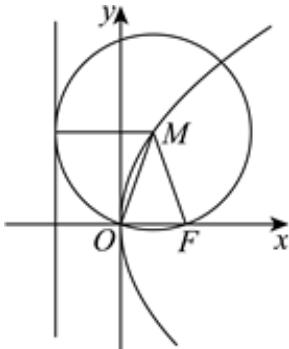

> [!faq]- 2024-2025学年内蒙古包头六中高二（下）月考数学试卷（6月份）解析
>
> > [!success]- **【答案】** 4
>
> > [!note]- **【解析】**
> > 由抛物线的定义结合已知条件可知 $|MF|=|MO|$ ，则 $\triangle MFO$ 为等腰三角形，
> >
> > 
> >
> > 易知抛物线 $y^{2}=2px\ (p>0)$ 的焦点为 $F(\frac{p}{2},0)$ ，故 $x_{0}=\frac{p}{4}$ ，即点 $M(\frac{p}{4},2\sqrt{2})$ 因为点P在抛物线 $y^{2}=2px\ (p>0)$ 上，则 $2p\times\frac{p}{4}=8$ ，解得p=4(负值舍去)，所以抛物线的方程为 $y^{2}=8x$ ，
> > 所以该抛物线的焦点到其准线的距离为p=4.
> > 故答案为：4.
