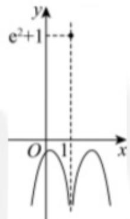

> [!faq]- 2024-2025学年内蒙古包头六中高二（下）月考数学试卷（6月份）解析
>
> > [!success]- **【答案】** $4 - e^{8};3 + \sqrt{2}$
>
> > [!note]- **【解析】**
> > 因为 $f(x)=\left\{\begin{aligned}e^{2}+1,x&=1\\ ln(x-1)^{2}&-(x-1)^{4},x\neq1\end{aligned}\right.$ 所以 $f(1)=e^{2}+1$ ，
> > 所以 $f(f(1))=f(e^{2}+1)=\ln(e^{2}+1-1)^{2}-(e^{2}+1-1)^{4}=4-e^{8}$ ;
> > 设 $g(x)=f(x+1)=\left\{\begin{aligned}e^{2}+1,x&=0\\ ln x^{2}-x^{4},&x\neq0\end{aligned}\right.$ 函数 $g(x)$ 的定义域为R，定义域关于原点对称，
> > 当 $x\neq0$ 时， $g(-x)=\ln(-x)^{2}-(-x)^{4}=\ln x^{2}-x^{4}=g(x)$ ，
> > 又 $g(-0)=g(0)=e^{2}+1$ ，
> > 所以函数 $g(x)$ 为偶函数，
> > 所以函数 $g(x)$ 图象关于y轴对称，
> > 故函数 $f(x)$ 图象关于直线x=1对称，
> > 当x>1时， $f(x)=\ln(x-1)^{2}-(x-1)^{4}=2\ln(x-1)-(x-1)^{4}$ ， $f'(x)=\frac{2}{x-1}-4(x-1)^{3}=\frac{2-4(x-1)^{4}}{x-1}$ 令 $f'(x)=0$ ，可得 $x=1+2^{-\frac{1}{4}}$ 当 $x>1+2^{-\frac{1}{4}}$ 时， $f'(x)<0$ ，函数 $f(x)$ 在 $(1+2^{-\frac{1}{4}},+\infty)$ 上单调递减，
> > 当 $1<x<1+2^{-\frac{1}{4}}$ 时， $f'(x)>0$ ，函数 $f(x)$ 在 $(1,1+2^{-\frac{1}{4}})$ 上单调递增，
> > 又 $f(1+2^{-\frac{1}{4}})=-\frac{1}{2}ln2-\frac{1}{2},f(1)=e^{2}+1$ 当 $x\to+\infty$ 时， $f(x)\to-\infty$ 当x>1且 $x\to1$ 时， $f(x)\to-\infty$ 所以函数 $f(x)$ 的图象如下：
> >
> > 
> >
> > 设 $t=f(x)$ ,
> >
> > 由图象可得当 $t = e^2 + 1$ 时，方程 $t = f(x)$ 的根为 $x = 1$
> >
> > 当 $t = -\frac{1}{2} ln2 - \frac{1}{2}$ 时，方程 $t = f(x)$ 有两个根，
> >
> > 当 $t < -\frac{1}{2} ln2 - \frac{1}{2}$ 时，方程 $t = f(x)$ 有四个根，
> >
> > 当 $-\frac{1}{2} ln2 - \frac{1}{2} < t < e^2 + 1$ 或 $t > e^2 + 1$ 时，方程 $t = f(x)$ 没有根，
> >
> > 因为函数 $y = f^{2}(x) + bf(x) + c$ 有3个不同的零点 $x_{1}, x_{2}, x_{3}$ ,
> >
> > 所以方程 $f^{2}(x) + bf(x) + c = 0$ 有3个不同的根 $x_{1}$ ， $x_{2}$ ， $x_{3}$ ，
> >
> > 所以方程 $t^2 + bt + c = 0$ 有两个根 $t = e^2 + 1$ 或 $t = -\frac{1}{2} \ln 2 - \frac{1}{2}$
> >
> > 不妨设 $x_{1}<x_{2}<x_{3}$ ，
> >
> > 则 $f(x)=e^{2}+1$ 的根为 $x_{2},x_{2}=1$ ,
> >
> > 方程 $f(x)=ln\frac{1}{2}-\frac{1}{4}$ 的根为 $x_{1},x_{3}$
> >
> > $$
> > x _ {1} = 1 - 2 ^ {- \frac {1}{4}}, x _ {3} = 1 + 2 ^ {- \frac {1}{4}}
> > $$
> >
> > 所以 $x_{1}^{2} + x_{2}^{2} + x_{3}^{2} = (1 - 2^{-\frac{1}{4}})^{2} + 1 + (1 + 2^{-\frac{1}{4}})^{2} = 3 + \sqrt{2}.$
> >
> > 故答案为： $4 - e^{8};3 + \sqrt{2}.$
