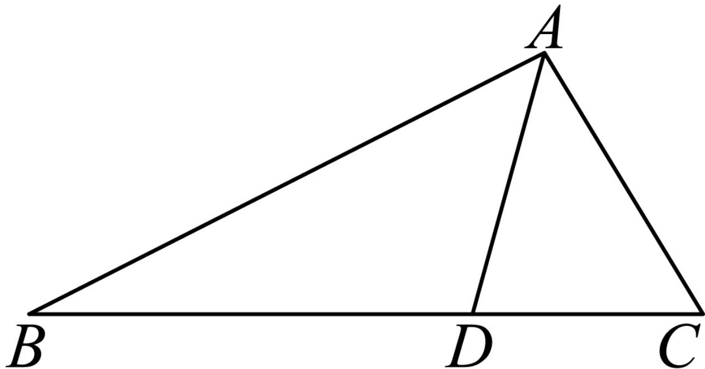

> [!faq]- 2024-2025学年内蒙古包头六中高二（下）月考数学试卷（6月份）解析
>
> > [!success]- **【答案】** 详见解析
>
> > [!note]- **【解析】**
> > 详见解析
> >
> > 
> >
> > $\angle BAD$ ， $\triangle ABD$ 面积是 $\triangle ACD$ 面积的3倍， $= \angle CAD$
> >
> > （I）由 $AD$ 为 $\angle BAC$ 的角平分线，可知 $\frac{BD}{CD}$
> >
> > $$
> > = \frac {A B}{A C}
> > $$
> >
> > 又 $\frac{BD}{CD}$ $= \frac{S_{\triangle ABD}}{S_{\triangle ACD}}$ $= 3$ 由正弦定理可得， $\frac{AB}{AC}$
> >
> > $\begin{array}{r l r} & {} & {= \frac{\sin C}{\sin B}} \\ & {} & {\text{所以} \frac{\sin C}{\sin B} \qquad , \text{即} \frac{\sin B}{\sin C}}\\ & {} & {= 3 \qquad = \frac{1}{3}} \end{array}$
> >
> > (Ⅱ) 设 $\angle ADC = \alpha$ ,
> >
> > 在 $\triangle ADC$ 中，因为 $AD = 1$ ， $CD = \frac{\sqrt{3}}{3}$
> >
> > 由余弦定理可得， $AC^{2}=AD^{2}+CD^{2}-2\cdot AD\cdot CD\cdot\cos\alpha$ ，所以 $AC^{2}=\frac{4}{3}-\frac{2\sqrt{3}}{3}\cos\alpha$ 在 $\triangle ADB$ 中，AD=1，BD=3CD= $\sqrt{3}$ ，
> >
> > 由余弦定理可得， $AB^{2} = AD^{2} + BD^{2} - 2\cdot AD\cdot BD\cdot \cos (\pi -\alpha)$
> >
> > 所以 $AB^{2} = 4 + 2\sqrt{3}\cos \alpha .$
> >
> > 所以 $AB^2 + 3AC^2 = 8$ ，又 $AB = 3AC$ ，所以 $AC = \frac{\sqrt{6}}{3}$ ， $AB = \sqrt{6}$ .
> >
> > 在 $\triangle ADC$ 中， $AD = 1$ ， $CD = \frac{\sqrt{3}}{3}$ ， $AC = \frac{\sqrt{6}}{3}$ ，因为 $AC^2 + CD^2 = AD^2$ ，所以角 $C$ 为直角，
> >
> > 所以 $S_{\triangle ACD}=\frac{1}{2}\times CD\times AC=\frac{\sqrt{2}}{6}$ ，
> >
> > 所以 $S_{\triangle ABD} = 3S_{\triangle ACD} = \frac{\sqrt{2}}{2}$
