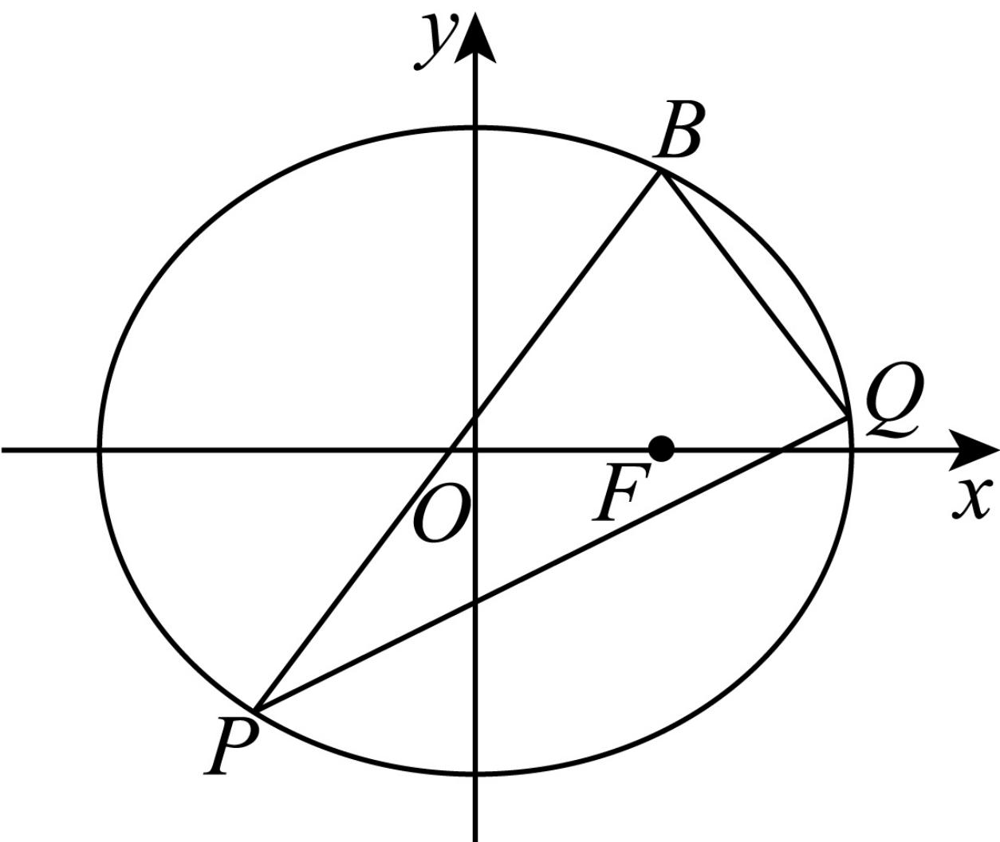
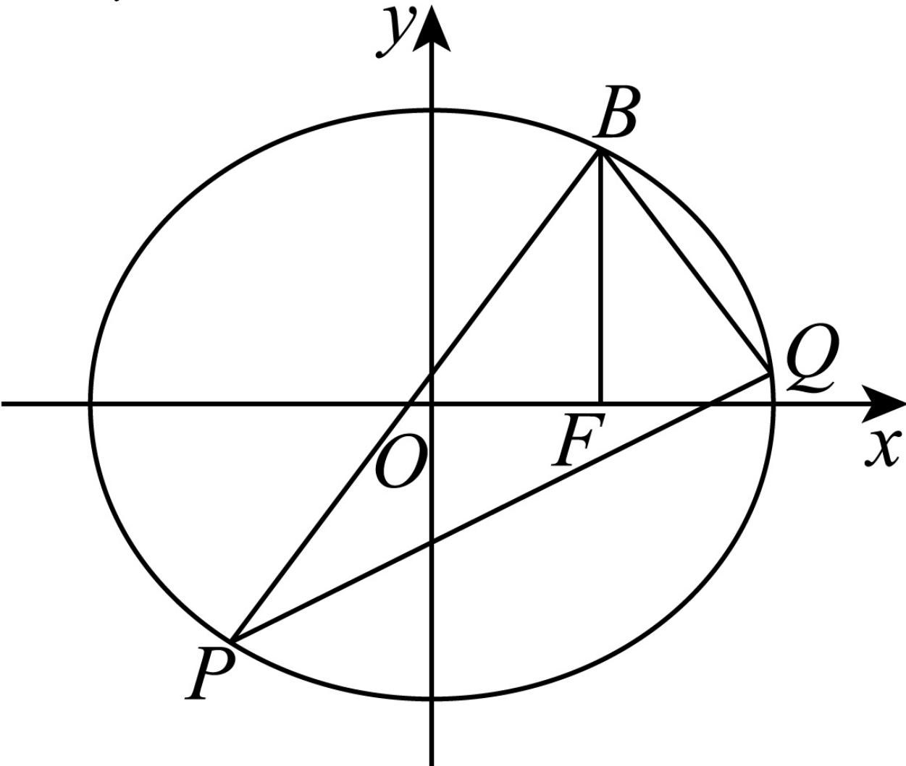

> [!faq]- 2024-2025学年内蒙古包头六中高二（下）月考数学试卷（6月份）解析
>
> > [!success]- **【答案】** 详见解析
>
> > [!note]- **【解析】**
> > 详见解析
> >
> > (1) 设椭圆C的半焦距为c，
> >
> > $$
> > F (1, 0)
> > $$
> >
> > $$
> > B (1, \frac {3}{2})
> > $$
> >
> > 由椭圆定义得， $2a = \sqrt{(1 + 1)^2 + (\frac{3}{2})^2} +\sqrt{(1 - 1)^2 + (\frac{3}{2})^2} = 4$
> >
> > 所以 $a = 2, b^2 = a^2 - c^2 = 3$
> >
> > 所以椭圆 $C$ 的方程为 $\frac{x^2}{4} +\frac{y^2}{3} = 1$
> >
> > (2)①证明：由题意可知直线l的斜率存在，设直线l:y=kx+m， $P(x_{1},y_{1})$ ， $Q(x_{2},y_{2})$
> >
> > 联立方程组 $\left\{\begin{aligned}y&=kx+m\\ \frac{x^{2}}{4}&+\frac{y^{2}}{3}=1\end{aligned}\right.$
> >
> > 得 $(3 + 4k^{2})x^{2} + 8kmx + 4m^{2} - 12 = 0$
> >
> > $$
> > \Delta = (8 k m) ^ {2} - 4 \left(3 + 4 k ^ {2}\right) \left(4 m ^ {2} - 1 2\right) > 0
> > $$
> >
> > 则 $x_{1} + x_{2} = \frac{-8km}{3 + 4k^{2}}$ ， $x_{1}x_{2} = \frac{4m^{2} - 12}{3 + 4k^{2}}$ ，①
> >
> > 由题意知， $k_{BP} + k_{BQ} = 0$
> >
> > $$
> > \frac {y _ {1} - \frac {3}{2}}{x _ {1} - 1} + \frac {y _ {2} - \frac {3}{2}}{x _ {2} - 1} = \frac {(x _ {2} - 1) (y _ {1} - \frac {3}{2}) + (x _ {1} - 1) (y _ {2} - \frac {3}{2})}{(x _ {1} - 1) (x _ {2} - 1)} = 0
> > $$
> >
> > $$
> > (x _ {2} - 1) \left(k x _ {1} + m - \frac {3}{2}\right) + (x _ {1} - 1) \left(k x _ {2} + m - \frac {3}{2}\right) = 0,
> > $$
> >
> > 化简得 $2kx_{1}x_{2} + (m - \frac{3}{2} - k)(x_{1} + x_{2}) - 2(m - \frac{3}{2}) = 0$
> >
> > 由①可得， $\frac{2k(4m^2 - 12)}{3 + 4k^2} +\frac{-8km(m - \frac{3}{2} - k)}{3 + 4k^2} -2(m - \frac{3}{2}) = 0$
> >
> > 化简得 $(2k - 1)(2k - 3 + 2m) = 0$
> >
> > 当 $2k-3+2m=0$ 时， $m=\frac{3}{2}-k$ ，
> >
> > 直线 $l$ 的方程为 $\pmb {y} = k\pmb {x} + \frac{3}{2} -k$ ，此时直线过点 $B(1,\frac{3}{2})$ ，矛盾，
> >
> > 所以 $k=\frac{1}{2}$ ，所以直线l的斜率为定值 $\frac{1}{2}$ ；
> >
> > 
> >
> > ②连接 $BF$ ，因为 $F(1,0)$ ， $B(1,\frac{3}{2})$ ，所以 $BF\perp x$ 轴，
> >
> > 由直线BP和直线BQ的斜率之和为0，可得BF平分∠PBQ
> >
> > 不妨设 $x_{1}<x_{2}$
> >
> > 由已知 $\tan\angle PBQ=\frac{2\tan\angle PBF}{1-\tan^{2}\angle PBF}=\frac{12}{5}$ ，解得 $\tan\angle PBF=\frac{2}{3}$ 或 $-\frac{3}{2}$ （舍）
> >
> > 所以直线 $PB$ 的斜率为 $\frac{3}{2}$ ，直线 $PB$ 的方程为 $y - \frac{3}{2} = \frac{3}{2}(x - 1)$ ，即 $y = \frac{3}{2} x$
> >
> > 所以点P，B关于原点对称，
> >
> > 所以点 $P(-1, -\frac{3}{2})$
> >
> > 所以直线l的方程为 $y+\frac{3}{2}=\frac{1}{2}(x+1)$ ，即 $y=\frac{1}{2}x-1$ ，
> >
> > 由①得 $x_{1}+x_{2}=\frac{4}{3+1}=1$ ，所以 $x_{2}=2$ ，
> >
> > 所以点 $Q(2,0)$ ，又 $B(1,\frac{3}{2})$
> >
> > 所以 $S_{\triangle PBQ} = S_{\triangle POQ} + S_{\triangle QOB} = \frac{1}{2}\times 2\times \frac{3}{2} +\frac{1}{2}\times 2\times \frac{3}{2} = 3,$
> >
> > 所以 $\triangle PBQ$ 的面积为3.
> >
> > 
