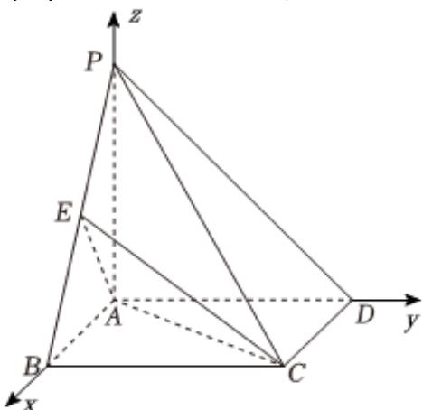

> [!faq]- 2024-2025学年内蒙古包头六中高二（下）月考数学试卷（6月份）解析
>
> > [!success]- **【答案】** 详见解析
>
> > [!note]- **【解析】**
> > 详见解析
> >
> > (1) 证明：以 $A$ 为原点， $\overrightarrow{AB}$ 的方向为 $x$ 轴的正方向，建立空间直角坐标系，
> >
> > 
> >
> > 不妨设 $AB = 2$ ，则 $AD = 2, PD = 2\sqrt{2}$
> >
> > 在直角三角形PAD中， $PA = \sqrt{PD^{2} - PA^{2}} = 2$
> >
> > $D(0,2,0),P(0,0,2),C(2,2,0),B(2,0,0)$
> >
> > 设 $\overrightarrow{PE} = \lambda \overrightarrow{PB} = (2\lambda, 0, -2\lambda)$ ，则 $B(2\lambda, 0, 2 - 2\lambda) (0 \leqslant \lambda \leqslant 1)$ ，
> >
> > $\overrightarrow{DP} = (0, -2, 2), \overrightarrow{CE} = (2\lambda - 2, -2, 2 - 2\lambda)$
> >
> > 由题意， $cos\langle \overrightarrow{DP},\overrightarrow{CE}\rangle = \frac{|\overrightarrow{DP}\bullet\overrightarrow{CE}|}{|\overrightarrow{DP}|\bullet|\overrightarrow{CE}|} = \frac{|8 - 4\lambda|}{2\sqrt{2}\bullet\sqrt{2(2\lambda - 2)^2 + 4}} = \frac{\sqrt{3}}{2}$
> >
> > 解得 $\lambda = \frac{1}{2}$
> >
> > 所以，点E为棱PB的中点.
> >
> > $$
> > \overrightarrow {C D} = (- 2, 0, 0), \overrightarrow {A C} = (2, 2, 0), \overrightarrow {A E} = (1, 0, 1)
> > $$
> >
> > 设平面ACE的法向量为 $\overrightarrow{n} = (x, y, z)$
> >
> > 则 $\left\{ \begin{array}{l} \overrightarrow{AC} \bullet \overrightarrow{n} = 0 \\ \overrightarrow{AE} \bullet \overrightarrow{n} = 0 \end{array} \right.$ ，即 $\left\{ \begin{array}{l} 2x + 2y = 0 \\ x + z = 0 \end{array} \right.$
> >
> > 取 $\overrightarrow{n}=(1,-1,-1)$ .
> >
> > 设直线CD与平面ACE所成角为 $\theta$ ，
> >
> > $$
> > | \sin \theta = | \cos \langle \overrightarrow {n}, \overrightarrow {C D} \rangle | = | \frac {- 2}{2 \times \sqrt {3}} | = \frac {\sqrt {3}}{3}
> > $$
> >
> > 所以，直线 $CD$ 与平面 $ACE$ 所成角的正弦值为 $\frac{\sqrt{3}}{3}$
