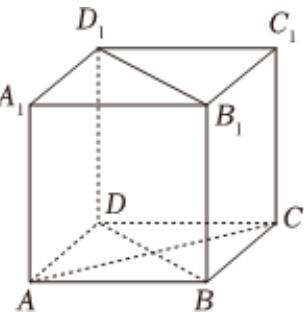

<!-- question-source:start -->
2、直四棱柱 $ABCD - A_{1}B_{1}C_{1}D_{1}$ 的所有棱长都为4， $\angle BAD = \frac{\pi}{3}$ ，点 $P$ 在四边形 $BDD_{1}B_{1}$ 及其内部运动，且满足 $|PA| + |PC| = 8$ ，则下列选项正确的是（A）

A 点P的轨迹的长度为 $\pi$ B 直线AP与平面 $BDD_{1}B_{1}$ 所成的角为定值
C 点P到平面 $AD_{1}B_{1}$ 的距离的最小值为 $\frac{2\sqrt{21}}{7}$ D $\overrightarrow{PA_{1}}\cdot\overrightarrow{PC_{1}}$ 的最小值为 -2
<!-- question-source:end -->

![[Q00092308A1]]
