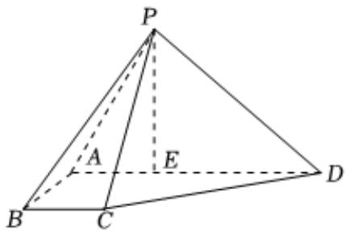

<!-- question-source:start -->
3、已知四棱锥 $P - ABCD, AD \parallel BC, AB = BC = 1, AD = 3$ ， $DE = PE = 2$ ， $E$ 是 $AD$ 上一点， $PE \perp AD$ .

1 若 $F$ 是 $PE$ 中点，证明： $BF \parallel$ 平面 $PCD$ .

2 若 $AB \perp$ 平面PED，求平面PAB与平面PCD夹角的余弦值.
<!-- question-source:end -->

![[Q00092315A1]]
