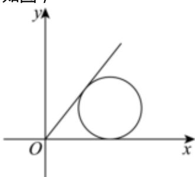

> [!faq]- 2024-2025学年内蒙古包头市景泰艺术中学高二（上）期中数学试卷解析
>
> > [!success]- **【答案】** A
>
> > [!note]- **【解析】**
> > 如图，
> >
> > 
> >
> > $x^{2} + y^{2} - 4x - 2y + 4 = 0$ 化为标准方程为 $(x - 2)^{2} + (y - 1)^{2} = 1$ ，圆心为 $(2,1)$ ，半径为1，过点 $(0,0)$ 与圆 $x^{2} + y^{2} - 4x - 2y + 4 = 0$ 相切的两条直线夹角为 $\alpha$ ，设切线为 $y = kx$ ，
> >
> > 则圆心(2,1)到切线y=kx的距离 $d=\frac{|2k-1|}{\sqrt{k^{2}+1}}=1$ ，解得 $k=\frac{4}{3}$ 或k=0，
> >
> > 故切线为 $y = \frac{4}{3} x$ 或 $y = 0$ ，即一条切线为 $x$ 轴，如图，
> >
> > 所以 $\tan \alpha = \frac{4}{3}$ ，且易知 $\alpha$ 一定为第一象限角，
> >
> > 解得 $\cos \alpha = \frac{3}{5}$ .
> >
> > 故选：A.
