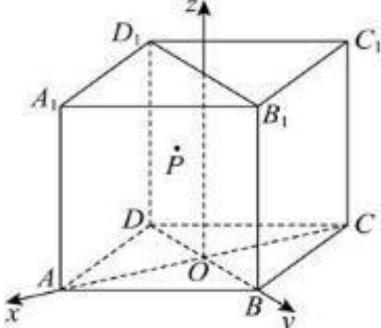

> [!faq]- 2024-2025学年内蒙古包头市景泰艺术中学高二（上）期中数学试卷解析
>
> > [!success]- **【答案】** BC
>
> > [!note]- **【解析】**
> > 直四棱柱 $ABCD - A_{1}B_{1}C_{1}D_{1}$ 的所有棱长都为4，则底面ABCD为菱形，
> >
> > 又 $\angle BAD = \frac{\pi}{3}$ ，则△ABD和△CBD都是等边三角形，
> >
> > 设BD与AC相交于点O，由 $BD\perp AC$ ，以O为原点，OA为x轴，OB为y轴，过O垂直于底面的直线为z轴，建立如图所示的空间直角坐标系，
> >
> > 
> >
> > 则有 $A(2\sqrt{3},0,0),B(0,2,0),C(-2\sqrt{3},0,0),D(0,-2,0)$
> >
> > $$
> > A _ {1} (2 \sqrt {3}, 0, 4), B _ {1} (0, 2, 4), C _ {1} (- 2 \sqrt {3}, 0, 4), D _ {1} (0, - 2, 4)
> > $$
> >
> > 点 $P$ 在四边形 $BDD_{1}B_{1}$ 及其内部运动，设 $P(0,y,z), - 2\leqslant y\leqslant 2,0\leqslant z\leqslant 4,$
> >
> > 由 $|PA|+|PC|=8$ ，有 $\sqrt{(2\sqrt{3})^{2}+y^{2}+z^{2}}+\sqrt{(-2\sqrt{3})^{2}+y^{2}+z^{2}}=8$ ，
> >
> > 即 $y^{2}+z^{2}=4(-2\leqslant y\leqslant2,0\leqslant z\leqslant2)$
> >
> > 所以点 $P$ 的轨迹为 $yOz$ 平面内，以 $O$ 为圆心，2为半径的半圆弧，
> >
> > 所以点 $P$ 的轨迹的长度为 $2\pi$ ， $A$ 选项错误；
> >
> > 平面 $BDD_{1}B_{1}$ 的法向量为 $\overrightarrow{m}=(1,0,0),\overrightarrow{AP}=(-2\sqrt{3},y,z)$ ，
> > 直线AP与平面 $BDD_{1}B_{1}$ 所成的角为 $\theta$ ，则 $\sin\theta=\frac{|\overrightarrow{AP}\cdot\overrightarrow{m}|}{|\overrightarrow{AP}||\overrightarrow{m}|}=\frac{2\sqrt{3}}{\sqrt{12+y^{2}+z^{2}}}=\frac{\sqrt{3}}{2}$ ，
> > 又由 $\theta\in[0,\frac{\pi}{2}]$ ，则 $\theta=\frac{\pi}{3}$ 所以直线AP与平面 $BDD_{1}B_{1}$ 所成的角为定值，B选项正确； $\overrightarrow{AB_{1}}=(-2\sqrt{3},2,4),\overrightarrow{AD_{1}}(-2\sqrt{3},-2,4)$ ，设平面 $AD_{1}B_{1}$ 的一个法向量为 $\overrightarrow{n}=(x,y,z)$ ，
> > 则有= $\left\{\begin{aligned}\overrightarrow{AB_{1}}\cdot\overrightarrow{n}&=-2\sqrt{3}x+2y+4z=0\\\overrightarrow{AD_{1}}\cdot\overrightarrow{n}&=-2\sqrt{3}x-2y+4z=0\end{aligned}\right.$ ，令x=2，得y=0， $z=\sqrt{3}$ ， $\overrightarrow{n}=(2,0,\sqrt{3})$ 所以点P到平面 $AD_{1}B_{1}$ 的距离 $d=\frac{|\overrightarrow{AP}\cdot\overrightarrow{n}|}{|\overrightarrow{n}|}=\frac{|-2\sqrt{3}\times2+\sqrt{3}z|}{\sqrt{2^{2}+(\sqrt{3})^{2}}}=\frac{|-4\sqrt{3}+\sqrt{3}z|}{\sqrt{7}}$ $0\leqslant z\leqslant2$ ，所以z=2时， $d_{min}=\frac{|-4\sqrt{3}+2\sqrt{3}|}{\sqrt{7}}=\frac{2\sqrt{21}}{7}$ 所以点P到平面 $AD_{1}B_{1}$ 的距离的最小值为 $\frac{2\sqrt{21}}{7}$ ，C选项正确； $\overrightarrow{PA_{1}}=(2\sqrt{3},-y,4-z),\overrightarrow{PC_{1}}=(-2\sqrt{3},-y,4-z)$ $\overrightarrow{PA_{1}}\cdot\overrightarrow{PC_{1}}=-12+y^{2}+(z-4)^{2}$ ，其几何意义为点 $P(y,z)$ 到点(0,4)距离的平方减12，
> > 由 $y^{2}+z^{2}=4$ ，点 $P(y,z)$ 到点(0,4)距离最小值为4-2=2， $\overrightarrow{PA_{1}}\cdot\overrightarrow{PC_{1}}$ 的最小值为 $2^{2}-12=-8,D$ 选项错误.
> > 故选：BC.
