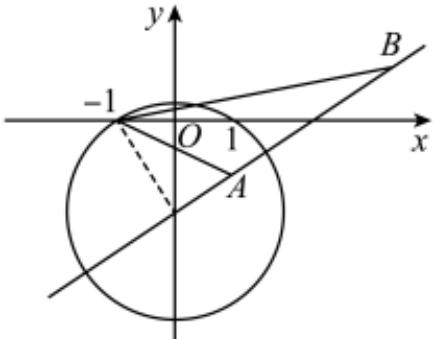
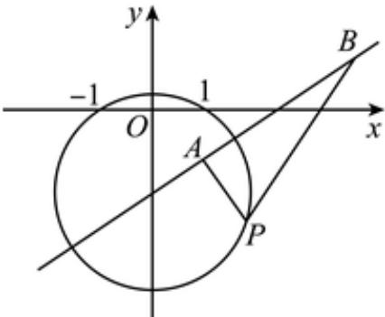
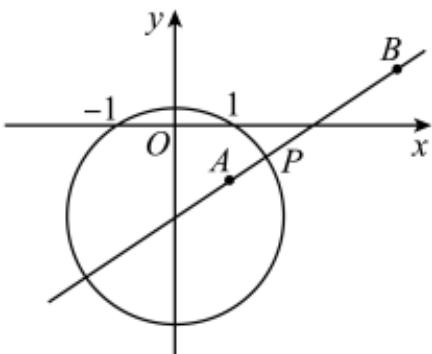

> [!faq]- 2024-2025学年内蒙古包头市景泰艺术中学高二（上）期中数学试卷解析
>
> > [!success]- **【答案】** BCD
>
> > [!note]- **【解析】**
> > 设 $P(x,y)$ ，则 $|PA|=\sqrt{(1-x)^{2}+(-1-y)^{2}}$ ， $|PB|=\sqrt{(4-x)^{2}+(1-y)^{2}}$ $\because |PB|=2|PA|,\therefore\sqrt{(4-x)^{2}+(1-y)^{2}}=2\sqrt{(1-x)^{2}+(-1-y)^{2}}$ 化简得 $x^{2}+(y+\frac{5}{3})^{2}=\frac{52}{9}$ ∴点P的轨迹方程是 $x^{2}+(y+\frac{5}{3})^{2}=(\frac{2\sqrt{13}}{3})^{2}$ 对于A，以AB为直径的圆的圆心为 $(\frac{5}{2},0)$ ，半径为 $\frac{|AB|}{2}=\frac{1}{2}\sqrt{(4-1)^{2}+(1-(-1))^{2}}=\frac{\sqrt{13}}{2}$ 故A错误；
> > 对于B，依题意可得直线AB的方程为 $y+1=\frac{1-(-1)}{4-1}(x-1)$ ，即 $y=\frac{2}{3}x-\frac{5}{3}$
> >
> > $\therefore$ 圆 $P$ 的圆心 $(0, -\frac{5}{3})$ 在直线 $AB$ 的方程上，
> >
> > ∴点P到直线AB的距离为圆P的半径时，△PAB的面积最大，
> >
> > $\therefore \triangle PAB$ 面积的最大值为 $(S_{\triangle PAB})_{\max} = \frac{1}{2}\times |AB|\times r = \frac{1}{2}\times \sqrt{13}\times \frac{2\sqrt{13}}{3} = \frac{13}{3}$ ，故 $B$ 正确；
> >
> > 
> >
> > 对于 $C$ ，由 $\vert PB\vert = 2\vert PA\vert$ ，在直角三角形中， $\frac{\pi}{6}$ 角对应的直角边是斜边的一半，
> >
> > 又 $1^{2}+(-1+\frac{5}{3})^{2}=(\frac{\sqrt{13}}{3})^{2}<(\frac{2\sqrt{13}}{3})^{2}$ ，则点A在圆P内，
> >
> > $\therefore$ 存在点 $P$ 使得 $\angle PAB = \frac{\pi}{2}$ ，此时 $\angle PBA = \frac{\pi}{6}$ ，故 $C$ 正确；
> >
> > 
> >
> > 对于 $D$ ，设 $\vert PA\vert = x$ ，则 $\vert PB\vert = 2x$
> >
> > 由余弦定理有 $13 = x^{2} + 4x^{2} - 2 \cdot x \cdot 2x \cdot \cos \angle APB = (5 - 4\cos \angle APB)x^{2}$
> >
> > $$
> > \therefore | P A | \cdot | P B | = x \cdot 2 x = 2 x ^ {2} = \frac {2 6}{5 - 4 \cos \angle A P B}
> > $$
> >
> > $\therefore$ 当 $\cos \angle A P B = -1$ ，即 $\angle A P B = \pi$ 时，有 $(|PA|\cdot |PB|)_{\min} = \frac{26}{9}$ ，故 $D$ 正确.
> >
> > 
> >
> > 故选：BCD.
