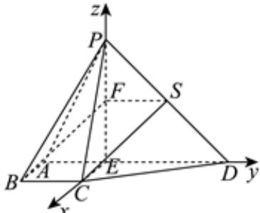

> [!faq]- 2024-2025学年内蒙古包头市景泰艺术中学高二（上）期中数学试卷解析
>
> > [!success]- **【答案】** 详见解析
>
> > [!note]- **【解析】**
> > 详见解析
> >
> > （1）证明：取 $PD$ 的中点为 $S$ ，接 $SF$ ， $SC$ ，则 $SF \parallel ED$ ， $SF = \frac{1}{2} ED = 1$ 而 $ED \parallel BC, ED = 2BC$ ，故 $SF \parallel BC$ ， $SF = BC$ 故四边形 $SFBC$ 为平行四边形，故 $BF \parallel SC$ ，而 $BF \nmid$ 平面 $PCD$ ， $SC \subset$ 平面 $PCD$ 所以 $BF \parallel$ 平面 $PCD$ .
> > (2)因为 $ED = 2$ ，故 $AE = 1$ ，故 $AE \parallel BC$ ， $AE = BC$ 故四边形 $AECB$ 为平行四边形，故 $CE \parallel AB$ ，所以 $CE \perp$ 平面 $PAD$ 而 $PE$ ， $ED \subset$ 平面 $PAD$ ，故 $CE \perp PE$ ， $CE \perp ED$ ，而 $PE \perp ED$ 故建立如图所示的空间直角坐标系，
> >
> > 
> >
> > 则 $A(0, - 1,0)$ ， $B(1, - 1,0)$ ， $C(1,0,0)$ ， $D(0,2,0)$ ， $P(0,0,2)$
> >
> > 则 $\overrightarrow{PA} = (0, -1, -2), \overrightarrow{PB} = (1, -1, -2), \overrightarrow{PC} = (1, 0, -2), \overrightarrow{PD} = (0, 2, -2)$ 设平面 $PAB$ 的法向量为 $\vec{m} = (x, y, z)$ ，则 $\left\{ \begin{array}{l} \vec{m} \perp \overrightarrow{PA} \\ \vec{m} \perp \overrightarrow{PB} \end{array} \right.$ ，则 $\left\{ \begin{array}{l} \vec{m} \bullet \overrightarrow{PA} = 0 \\ \vec{m} \bullet \overrightarrow{PB} = 0 \end{array} \right.$ ，可得 $\left\{ \begin{array}{l} -y - 2z = 0 \\ x - y - 2z = 0 \end{array} \right.$ ，取 $\vec{m} = (0, -2, 1)$ ，设平面 $PCD$ 的法向量为 $\vec{n} = (a, b, c)$ ，则 $\left\{ \begin{array}{l} \vec{n} \perp \overrightarrow{PC} \\ \vec{n} \perp \overrightarrow{PD} \end{array} \right.$ ，则 $\left\{ \begin{array}{l} \vec{n} \bullet \overrightarrow{PC} = 0 \\ \vec{n} \bullet \overrightarrow{PD} = 0 \end{array} \right.$ ，可得 $\left\{ \begin{array}{l} a - 2b = 0 \\ 2b - 2c = 0 \end{array} \right.$ ，取 $\vec{n} = (2, 1, 1)$ ，故 $cos < \vec{m}, \vec{n} > = \frac{-1}{\sqrt{5} \times \sqrt{6}} = -\frac{\sqrt{30}}{30}$ ，故平面 $PAB$ 与平面 $PCD$ 夹角的余弦值为 $\frac{\sqrt{30}}{30}$ .
