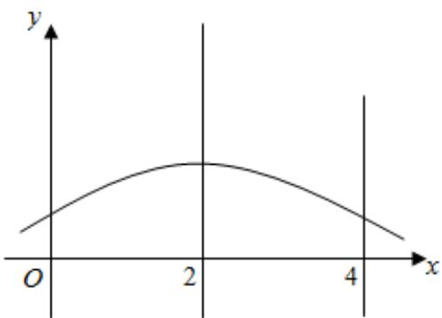

> [!faq]- 2024-2025学年内蒙古包头市景泰高级中学高二（下）期中数学试卷解析
>
> > [!success]- **【答案】** C
>
> > [!note]- **【解析】**
> > ∵随机变量X服从正态分布 $N(2,\sigma^{2})$ ,
> >
> > $\mu = 2$ ，得对称轴是 $x = 2$
> >
> > $$
> > P (\xi <   4) = 0. 8
> > $$
> >
> > $$
> > \therefore P (\xi \geqslant 4) = P (\xi \leqslant 0) = 0. 2,
> > $$
> >
> > $$
> > \therefore P (0 <   \xi <   4) = 0. 6
> > $$
> >
> > $$
> > \therefore P (0 <   \xi <   2) = 0. 3.
> > $$
> >
> > 故选：C.
> >
> > 
