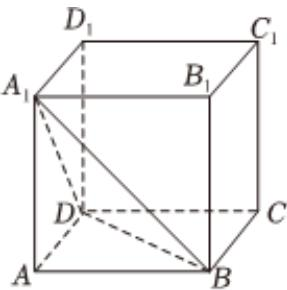

<!-- question-source:start -->
6、已知双曲线 $\frac{x^2}{a^2} -\frac{y^2}{b^2} = 1(a > b > 0)$ 的其中一条渐近线的倾斜角为 $\frac{\pi}{6}$ ，则双曲线的离心率为（）A $\frac{2\sqrt{3}}{3}$ B $\frac{2\sqrt{6}}{3}$ C $\sqrt{3}$ D 2

<!-- question-source:end -->

![[Q00092345A1]]
