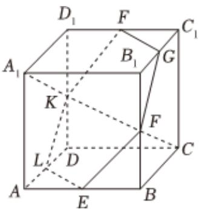

<!-- question-source:start -->
2、如图，在棱长为1的正方体 $ABCD - A_{1}B_{1}C_{1}D_{1}$ 中， $E, F, G, H, K$ ， $L$ 分别是 $AB, BB_{1}, B_{1}C_{1}, C_{1}D_{1}, D_{1}D, DA$ 各棱的中点.

(1)求证： $A_{1}C\bot$ 平面EFGHKL；

(2)求DA与平面EFGHKL所成角的正弦值.

<!-- question-source:end -->

![[Q00092357A1]]
