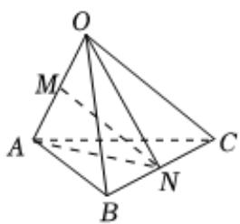

> [!faq]- 2024-2025学年内蒙古包头市高二（上）期末数学试卷解析
>
> > [!success]- **【答案】** C
>
> > [!note]- **【解析】**
> > 如图所示，连接ON，AN，
> >
> > $$
> > \overrightarrow {O N} = \frac {1}{2} (\overrightarrow {O B} + \overrightarrow {O C}) = \frac {1}{2} (\overrightarrow {b} + \overrightarrow {c}),
> > $$
> >
> > $$
> > \overrightarrow {A N} = \frac {1}{2} (\overrightarrow {A C} + \overrightarrow {A B})
> > $$
> >
> > $$
> > = \frac {1}{2} (\overrightarrow {O C} - 2 \overrightarrow {O A} + \overrightarrow {O B})
> > $$
> >
> > 
> >
> > $$
> > = \frac {1}{2} (- 2 \overrightarrow {a} + \overrightarrow {b} + \overrightarrow {c})
> > $$
> >
> > $$
> > = - \overrightarrow {a} + \frac {1}{2} \overrightarrow {b} + \frac {1}{2} \overrightarrow {c},
> > $$
> >
> > 所以 $\overrightarrow{MN} = \frac{1}{2} (\overrightarrow{ON} +\overrightarrow{AN}) = -\frac{1}{2}\overrightarrow{a} +\frac{1}{2}\overrightarrow{b} +\frac{1}{2}\overrightarrow{c}.$
> >
> > 故选：C.
