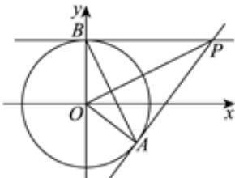

> [!faq]- 2024-2025学年内蒙古包头市高二（上）期末数学试卷解析
>
> > [!success]- **【答案】** ACD
>
> > [!note]- **【解析】**
> > 根据题意，过点 $P(2,1)$ 作圆 $O: x^{2} + y^{2} = 1$ 的两条切线，
> >
> > 则两条切线的斜率都存在，设切线方程为 $y - 1 = k(x - 2)$ ，即 $kx - y - 2k + 1 = 0$ ，
> >
> > 根据圆心 $O$ 到直线 $kx - y - 2k + 1 = 0$ 的距离等于半径 $\pmb{r}$ ，可得 $d = \frac{| - 2k + 1|}{\sqrt{1 + k^2}} = 1$ ，解得 $k = 0$ 或 $k = \frac{4}{3}$ ，
> >
> > 所以切线方程为 $y = 1$ 或 $4x - 3y - 5 = 0$ ，故 $A$ 项正确， $B$ 项不正确；
> >
> > 
> >
> > 因为PA、PB是圆O的切线，所以PB⊥OB且PA⊥OA，可得P、B、O、A四点共圆，根据∠PBO = ∠PAO, OB = OA, PO = PO，可知△POB ≅ △POA，
> >
> > 所以 $PO$ 平分 $AB$ ， $PA = PB$ ，可得 $PO$ 是 $AB$ 的中垂线，即 $OP \perp AB$ ，故 $C$ 项正确；
> >
> > 由 $P(2,1)$ ，可知 $\vert PO\vert = \sqrt{2^2 + 1^2} = \sqrt{5}$ ， $\vert PB\vert = \sqrt{\vert PO\vert^2 - \vert OB\vert^2} = 2$
> >
> > 所以四边形OAPB的面积 $S=2S_{\triangle POB}=2\times\frac{1}{2}|OB|\bullet|PB|=2\times\frac{1}{2}\times1\times2=2$ ，故D项正确.
> > 故选：ACD.
