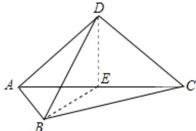

> [!faq]- 2024-2025学年内蒙古包头市高二（上）期末数学试卷解析
>
> > [!success]- **【答案】** $90^{\circ}$
>
> > [!note]- **【解析】**
> > 取 $AC$ 的中点 $\pmb{E}$ ，连接 $DE, BE$
> >
> > 
> >
> > ∵ ABCD 是正方形，
> >
> > $$
> > \therefore A C \perp B E, A C \perp D E.
> > $$
> >
> > $$
> > \because B E \cap D E = E
> > $$
> >
> > $$
> > \therefore A C \perp \text {面} B D E
> > $$
> >
> > $$
> > \because B D \subset \text {面} B D E
> > $$
> >
> > $$
> > \therefore A C \perp B D
> > $$
> >
> > ∴异面直线AC，BD的所成角为90°.
> >
> > 故答案为： $90^{\circ}$
