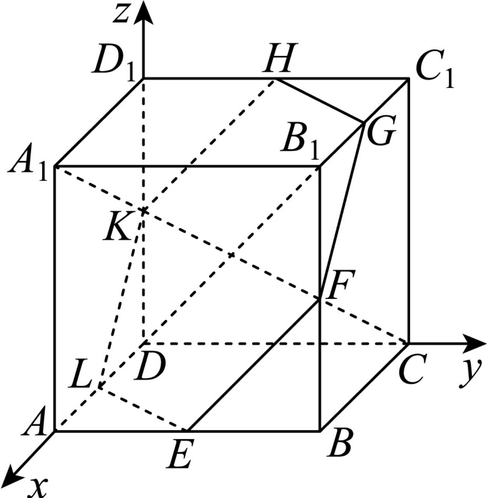

> [!faq]- 2024-2025学年内蒙古包头市高二（上）期末数学试卷解析
>
> > [!success]- **【答案】** 详见解析
>
> > [!note]- **【解析】**
> > 详见解析
> >
> > (1) 如图所示建立空间直角坐标系，
> >
> > 
> >
> > $A_{1}(1,0,1),C(0,1,0),K(0,0,\frac{1}{2}),H(0,\frac{1}{2},1),L(\frac{1}{2},0,0)$
> >
> > $$
> > \overrightarrow {L K} = \left(- \frac {1}{2}, 0, \frac {1}{2}\right), \overrightarrow {K H} = \left(0, \frac {1}{2}, \frac {1}{2}\right), \overrightarrow {A _ {1} C} = \left(- 1, 1, - 1\right),
> > $$
> >
> > 则 $\left\{ \begin{array}{l}\overrightarrow{A_1C} \perp \overrightarrow{LK}\\ \overrightarrow{A_1C} \perp \overrightarrow{KH} \end{array} \right.$ ，则 $\left\{ \begin{array}{l}\overrightarrow{A_1C}\bullet \overrightarrow{LK} = \frac{1}{2} +0 - \frac{1}{2} = 0\\ \overrightarrow{A_1C}\bullet \overrightarrow{KH} = 0 + \frac{1}{2} -\frac{1}{2} = 0 \end{array} \right.$
> >
> > 所以 $A_{1}C\perp LK$ ， $A_{1}C\perp KH$ ，
> >
> > LK，KH为平面EFGHKL的两条相交直线，
> >
> > 所以 $A_{1}C \perp$ 平面 $EFGHKL$ ；
> >
> > (2)由（1）知平面 $EFGHKL$ 的法向量为 $\overrightarrow{A_{1}C} = (-1, 1, -1)$ ,
> >
> > $D(0,0,0),A(1,0,0),\overrightarrow{DA} = (1,0,0)$
> >
> > 因为 $cos<\overrightarrow{A_{1}C}$ ， $\overrightarrow{DA}>=\frac{\overrightarrow{A_{1}C}\bullet\overrightarrow{DA}}{|\overrightarrow{A_{1}C}|\bullet|\overrightarrow{DA}|}=\frac{-1+0+0}{\sqrt{3}\times1}=-\frac{\sqrt{3}}{3}$
> >
> > 求DA与平面EFGHKL所成角的正弦值为 $\frac{\sqrt{3}}{3}$ .
