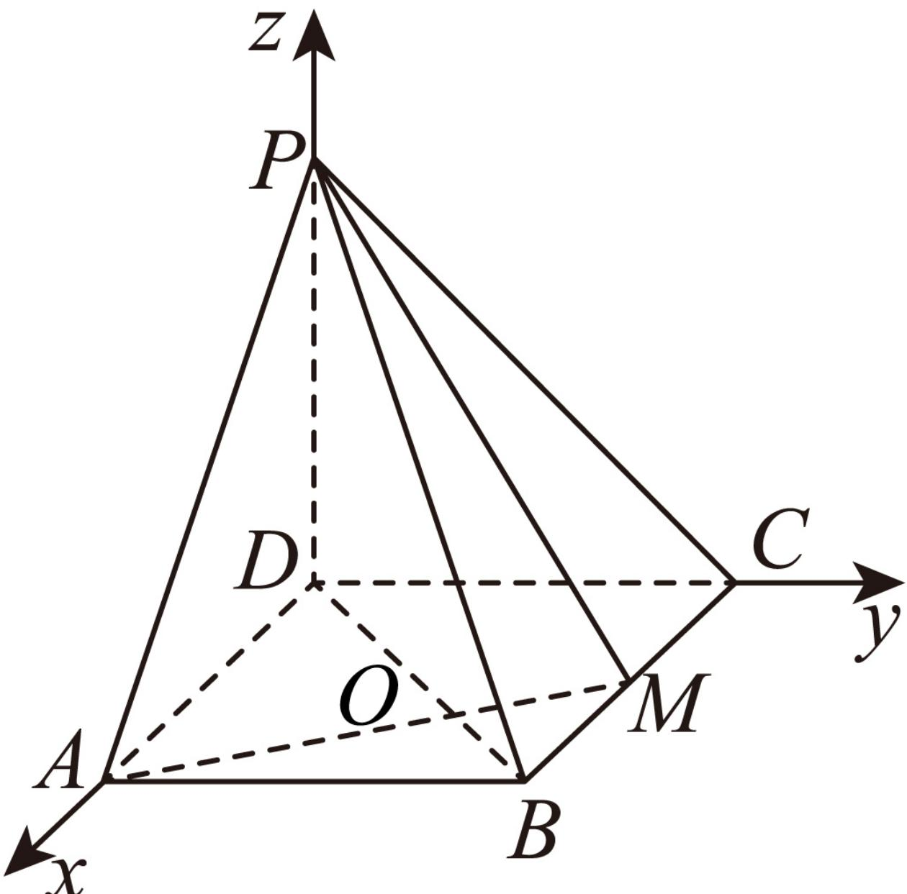

> [!faq]- 2024-2025学年内蒙古包头市高二（上）期末数学试卷解析
>
> > [!success]- **【答案】** 详见解析
>
> > [!note]- **【解析】**
> > 详见解析
> >
> > (1)证明：在矩形ABCD中， $\angle DAB = \angle ABM = 90^{\circ}$
> >
> > $\frac{AD}{AB} = \frac{AB}{BM} = \sqrt{2}$ ，所以△ $ABD\sim \triangle BMA$ ，所以∠ $BAM = \angle ADB$
> >
> > 设 $AM$ 与 $BD$ 交于 $O$ 点，所以 $\angle DOM = \angle ADB + \angle DAM = \angle BAM + \angle DAM = 90^{\circ}$
> >
> > 所以 $AM \perp BD$ ，又因为 $PD \perp$ 平面 $ABCD$ ， $AM \subset$ 平面 $ABCD$ ，所以 $PD \perp AM$
> >
> > 又 $BD \cap PD = D$ , $BD$ , $PD \subset$ 平面 $PDB$ ,
> >
> > 所以 $AM \perp$ 平面PDB，又 $BP \subset$ 平面PDB，
> >
> > 所以 $AM \perp BP.$
> >
> > (2)以 $D$ 为坐标原点，以 $DA$ ， $DC$ ， $DP$ 所在直线分别为 $\pmb{x}$ 轴， $\pmb{y}$ 轴， $z$ 轴建立空间直角坐标系，如图所示，
> >
> > 
> >
> > 则 $P(0,0,2),A(2\sqrt{2},0,0),M(\sqrt{2},2,0),B(2\sqrt{2},2,0)$
> >
> > 所以 $\overrightarrow{PA} = (2\sqrt{2}, 0, -2)$ , $\overrightarrow{PM} = (\sqrt{2}, 2, -2)$ .
> >
> > 易知平面PCD的一个法向量 $\overrightarrow{DA}=(2\sqrt{2},0,0)$ ，
> >
> > 设平面PAM的法向量为 $\overrightarrow{n}=(x,y,z)$ ,
> >
> > 所以 $\left\{\begin{aligned}\overrightarrow{n}\bullet\overrightarrow{PA}=0\\\overrightarrow{n}\bullet\overrightarrow{PM}=0\end{aligned}\right.$ ，即 $\left\{\begin{aligned}2\sqrt{2}x-2z=0\\\sqrt{2}x+2y-2z=0\end{aligned}\right.$
> >
> > 取 $y=1$ ，则 $\overrightarrow{n}=(\sqrt{2},1,2)$ .
> >
> > 设平面PCD与平面PAM的夹角为 $\theta$ ，
> >
> > $$
> > \cos \theta = \frac {| \overrightarrow {D A} \bullet \overrightarrow {n} |}{| \overrightarrow {D A} | | \overrightarrow {n} |} = \frac {2 \sqrt {2} \times \sqrt {2}}{2 \sqrt {2} \times \sqrt {\left(\sqrt {2}\right) ^ {2} + 1 + 2 ^ {2}}} = \frac {\sqrt {1 4}}{7}.
> > $$
