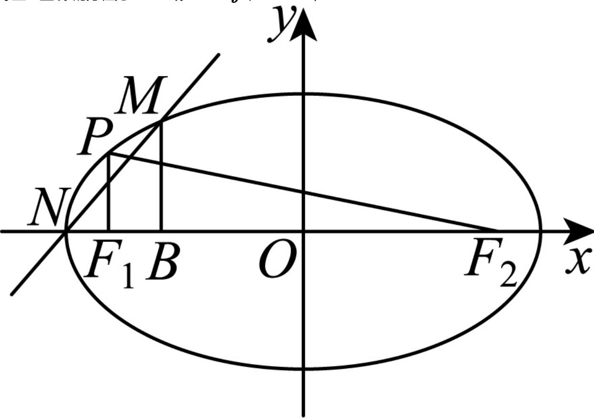

> [!faq]- 2024-2025学年内蒙古包头市高二（上）期末数学试卷解析
>
> > [!success]- **【答案】** 详见解析
>
> > [!note]- **【解析】**
> > 详见解析
> >
> > （1）因为 $PF_{1} \perp F_{1}F_{2}$ ，所以椭圆 $C$ 的左焦点 $F_{1}$ 的坐标是 $(- \sqrt{2}, 0)$ ，
> >
> > 所以 $\left\{ \begin{array}{l}a^2 -b^2 = 2\\ \frac{2}{a^2} +\frac{1}{3b^2} = 1 \end{array} \right.$ ，解得 $\left\{ \begin{array}{l}a^2 = 3\\ b^2 = 1 \end{array} \right.$
> >
> > 所以椭圆 $C$ 的方程为 $\frac{x^2}{3} + y^2 = 1$ .
> >
> > (2)当直线l与x轴垂直，
> >
> > 则直线l与椭圆C的交点M，N的坐标分别是 $(0,-1)$ ， $(0,1)$ ，所以 $\overrightarrow{BM} = (1, -1), \overrightarrow{BN} = (1, 1)$ ， $\therefore \overrightarrow{BM} \bullet \overrightarrow{BN} = 1 - 1 = 0$ ，符合题意；此时直线的方程是 $x = 0$ ；
> >
> > 若直线 $l$ 与 $\pmb{x}$ 轴不垂直，设直线的方程是 $y = kx + 2$
> >
> > 由 $\left\{\begin{aligned}\frac{x^{2}}{3}+y^{2}=1\\ y=kx+2\end{aligned}\right.$ ，消去y并整理，得 $(1+3k^{2})x^{2}+12kx+9=0$ ，
> >
> > 设 $M(x_{1},y_{1})$ ， $N(x_{2},y_{2})$ ，则 $\Delta = (12k)^{2} - 36(1 + 3k^{2}) = 36(k^{2} - 1) > 0$
> >
> > $$
> > x _ {1} + x _ {2} = - \frac {1 2 k}{1 + 3 k ^ {2}}, x _ {1} x _ {2} = \frac {9}{1 + 3 k ^ {2}},
> > $$
> >
> > $$
> > y _ {1} y _ {2} = \left(k x _ {1} + 2\right) \left(k x _ {2} + 2\right) = k ^ {2} x _ {1} x _ {2} + 2 k \left(x _ {1} + x _ {2}\right) + 4,
> > $$
> >
> > 又 $BM \perp BN$ ，所以 $\overrightarrow{BM} \bullet \overrightarrow{BN} = 0$ ，即 $(x_{1} + 1)(x_{2} + 1) + y_{1}y_{2} = 0$
> >
> > 所以 $x_{1}x_{2} + (x_{1} + x_{2}) + y_{1}y_{2} + 1 = x_{1}x_{2} + (x_{1} + x_{2}) + [k^{2}x_{1}x_{2} + 2k(x_{1} + x_{2}) + 4] + 1$
> >
> > $$
> > = (k ^ {2} + 1) x _ {1} x _ {2} + (2 k + 1) \left(x _ {1} + x _ {2}\right) + 5 = 0
> > $$
> >
> > 即 $\frac{9(k^2 + 1)}{1 + 3k^2} - \frac{12k(2k + 1)}{1 + 3k^2} + 5 = 0$
> >
> > $$
> > 9 (k ^ {2} + 1) - 1 2 k (2 k + 1) + 5 (1 + 3 k ^ {2}) = 0, \therefore k = \frac {7}{6},
> > $$
> >
> > 显然 $k=\frac{7}{6}$ 满足 $\Delta>0$ ，
> >
> > 所以直线l与x轴不垂直时，直线的方程是 $y=\frac{7}{6}x+2$ ，即 $7x-6y+12=0$ 。
> >
> > 综上：直线l的方程为x=0或7x-6y+12=0，
> >
> > 
