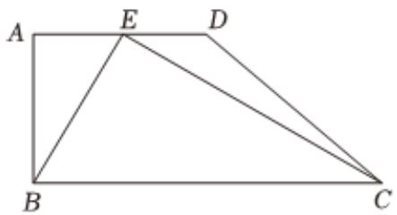
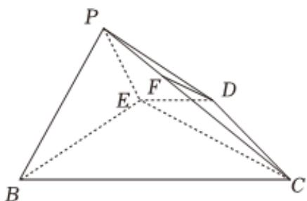

<!-- question-source:start -->
3. 如图，在四边形ABCD中， $AD = 1, AB \perp AD, AD \parallel BC, \angle AEB = 60^{\circ}$ ， $\angle BEC = 90^{\circ}$ ， $E$ 是 $AD$ 的中点。现将 $\triangle ABE$ 沿 $BE$ 翻折，使得点 $A$ 移动至平面BCDE外的点 $P$ 。

1 若点 $F$ 是靠近 $P$ 的四等分点，求证： $DF \parallel$ 平面 $PBE$ ；

2 若平面PBE⊥平面BCDE，求平面PCD与平面PBE所成二面角的正弦值.
<!-- question-source:end -->

![[Q00092363A1]]
