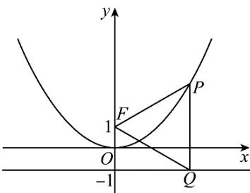

> [!faq]- 2024-2025学年内蒙古包头市高二（下）期末数学试卷解析
>
> > [!success]- **【答案】** C
>
> > [!note]- **【解析】**
> > 已知抛物线 $x^{2} = 4y$ 的焦点为 $F$ ，准线为 $l$ ，过抛物线上一点 $P$ 作 $PQ \perp l$ 且垂足为 $Q$ 则 $|PQ| = |PF| = y_P + 1 = 4$
> >
> > 则 $y_{P}=3$ ，
> >
> > 代入抛物线方程得 $x_{P}=\pm2\sqrt{3}$ ，
> >
> > 所以 $Q(\pm 2\sqrt{3}, -1)$
> >
> > 又 $F(0,1)$
> >
> > 即 $k_{FQ}=\pm\frac{2}{2\sqrt{3}}=\pm\frac{\sqrt{3}}{3}.$
> >
> > 故选：C.
> >
> > 
