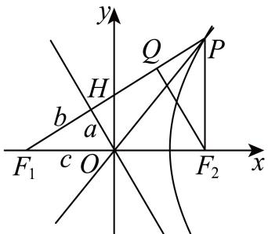

> [!faq]- 2024-2025学年内蒙古包头市高二（下）期末数学试卷解析
>
> > [!success]- **【答案】** ACD
>
> > [!note]- **【解析】**
> > A选项，渐近线方程为 $y=-\frac{b}{a}x$ ， $F_{1}(-c,0)$ ，
> >
> > 
> >
> > $$
> > d = \left| F _ {1} H \right| = \frac {\left| - c \cdot b \right|}{\sqrt {a ^ {2} + b ^ {2}}} = \frac {c \cdot b}{c} = b, | O H | = \sqrt {c ^ {2} - b ^ {2}} = a,
> > $$
> >
> > 过点 $F_{2}$ 向 $F_{1}P$ 作垂线，垂足为Q，因为 $OH\perp F_{1}Q$ ， $F_{2}Q\perp F_{1}Q$ ，所以 $OH//F_{2}Q$ ，又O为 $F_{1}F_{2}$ 中点且 $|OH|=a$ ，则 $|F_{2}Q|=2a$ ，
> >
> > 由 $cos\angle F_{1}PF_{2}=\frac{3}{5}$ ，可得 $sin\angle F_{1}PF_{2}=\sqrt{1-\left(\frac{3}{5}\right)^{2}}=\frac{4}{5}$ ， $tan\angle F_{1}PF_{2}=\frac{4}{3}$ ，
> >
> > 在 $Rt\triangle PQF_{2}$ 中， $\left|PF_2\right| = \frac{\left|F_2Q\right|}{sin\angle F_1PF_2} = \frac{2a}{\frac{4}{5}} = 5$ ，解得 $a = 2$
> >
> > $$
> > \left\{ \begin{array}{l} | P F _ {1} | - | P F _ {2} | = 2 a = 4 \\ | P F _ {1} | = | F _ {1} Q | + | Q P | = 2 b + \frac {2 a}{\tan \angle F _ {1} P F _ {2}} \end{array} \Rightarrow \left\{ \begin{array}{l} | P F _ {1} | = 9 \\ 2 b + \frac {4}{(\frac {4}{3})} = 9 \end{array} \Rightarrow b = 3, c = \sqrt {1 3}, \right. \right.
> > $$
> >
> > 所以实轴长 $2a = 4$ ，所以 $\mathbf{A}$ 选项正确；
> >
> > $B$ 选项， $e = \frac{c}{a} = \frac{\sqrt{13}}{2}$ ，所以 $B$ 选项错误；
> >
> > $C$ 选项， $\triangle PF_{1}F_{2}$ 的面积 $S_{1} = \frac{1}{2} |F_{1}P||F_{2}P|\sin \angle F_{1}PF_{2} = \frac{1}{2}\cdot 9\cdot 5\cdot \sqrt{1 - \left(\frac{3}{5}\right)^{2}} = 18$
> >
> > $$
> > S _ {\triangle F _ {1} H O} = \frac {1}{2} a b = \frac {1}{2} \cdot 2 \cdot 3 = 3
> > $$
> >
> > 所以 $S_{OF_2PH} = S_1 - S_{\triangle F_1HO} = 18 - 3 = 15$ ，所以 $C$ 选项正确；
> >
> > $D$ 选项，在 $\triangle F_{1}F_{2}Q$ 中， $F_{2}Q\bot PF_{1}$ ， $OH\bot PF_{1}$ ， $O$ 为 $F_{1}F_{2}$ 中点，
> >
> > 所以 $\pmb{H}$ 为 $F_{1}Q$ 中点，即 $\left|F_1H\right| = \left|HQ\right| = b = 3$
> >
> > 又 $tan\angle F_{1}PF_{2}=\frac{|QF_{2}|}{|PQ|}=\frac{2a}{|PQ|}=\frac{4}{3}$ ，所以 $|PQ|=\frac{3}{2}a=3$ ，所以 $|\overrightarrow{PH}| = |\overrightarrow{PQ}| + |\overrightarrow{QH}| = 2|\overrightarrow{HF_1}|$ ，又因为 $\overrightarrow{PH}$ ， $\overrightarrow{HF_1}$ 共线且方向相同，所以 $\overrightarrow{PH} = 2\overrightarrow{HF}$ ，所以 $D$ 选项正确.  
> > 故选： $ACD$ .
