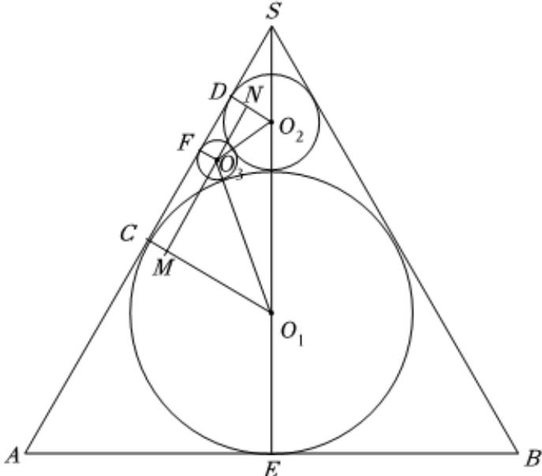

> [!faq]- 2024-2025学年内蒙古包头市高二（下）期末数学试卷解析
>
> > [!success]- **【答案】** $3-\frac{3\sqrt{3}}{2}$
>
> > [!note]- **【解析】**
> > 做出圆锥的轴截面的示意图如下：
> >
> > 
> >
> > 因为面半径为 $3\sqrt{3}$ 及轴截面为正三角形的圆锥中放置内切球 $O_{1}$ ，在球 $O_{1}$ 的上面放一个与球 $O_{1}$ 和圆锥侧面均相切的球 $O_{2}$ ，再在 $O_{1}$ 和 $O_{2}$ 之间放入一个球 $O_{3}$ ，所以当球 $O_{3}$ 与 $O_{1}$ 和 $O_{2}$ 相切，且与母线相切时，球 $O_{3}$ 半径的最大，易知内切球 $O_{1}$ 的半径 $r_1 = \frac{1}{3} SA\bullet sin\frac{\pi}{3} = 3$ ，设球 $O_{2}$ 的半径为 $r_2$ ，球 $O_{3}$ 的半径为 $\pmb{r}$
> >
> > 因为 $\sin\angle DSO_{2}=\frac{DO_{2}}{SO_{2}}=\frac{r_{2}}{SO_{2}}=sin30^{\circ}=\frac{1}{2}$ ，所以 $SO_{2}=2r_{2}$ ，
> > 所以 $SO_{2}+r_{2}=3r_{2}=SE-2r_{1}=9-6=3$ ，所以 $r_{2}=1$ 所以 $AC=3\sqrt{3}$ ， $SD=\sqrt{3}$ ， $CD=2\sqrt{3}$ $\sin\angle MO_{3}O_{1}=\frac{MO_{1}}{O_{1}O_{3}}=\frac{3-r}{3+r}$ ， $\sin\angle NO_{3}O_{2}=\frac{NO_{2}}{O_{2}O_{3}}=\frac{1-r}{1+r}$ 则 $\cos\angle MO_{3}O_{1}=\frac{2\sqrt{3r}}{3+r}$ ， $\cos\angle NO_{3}O_{2}=\frac{2\sqrt{r}}{1+r}$ $CD=MN=(3+r)\cos\angle MO_{3}O_{1}+(1+r)\cos\angle NO_{3}O_{2}$ $=2\sqrt{3r}+2\sqrt{r}=2\sqrt{3}\Rightarrow\sqrt{r}=\frac{3-\sqrt{3}}{2}$ 所以 $r=3-\frac{3\sqrt{3}}{2}$ .
> > 故答案为： $3-\frac{3\sqrt{3}}{2}$
